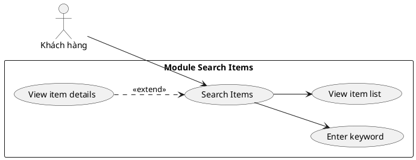
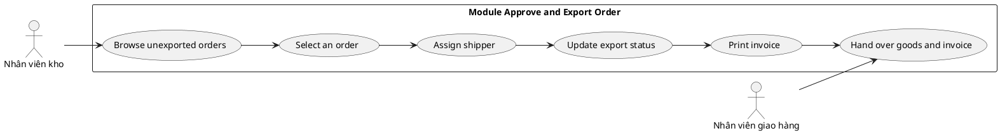

# BÀI TẬP PHÂN TÍCH THIẾT KẾ HỆ THỐNG QUẢN LÝ SIÊU THỊ TRỰC TUYẾN

## 1. Mô tả bài toán

Hệ thống quản lý siêu thị trực tuyến cho phép các đối tượng sau tương tác với hệ thống:

- Khách hàng: đăng ký thành viên, tìm kiếm và xem thông tin sản phẩm, đặt hàng trực tuyến, mua hàng trực tiếp tại quầy.
- Nhân viên bán hàng: bán hàng tại quầy cho khách mua trực tiếp.
- Nhân viên kho: nhập hàng từ nhà cung cấp, quản lý thông tin mặt hàng và nhà cung cấp, duyệt đơn hàng trực tuyến, chọn nhân viên giao hàng, cập nhật trạng thái xuất kho, in hóa đơn và bàn giao hàng hóa cùng hóa đơn cho nhân viên giao hàng.
- Nhân viên giao hàng: nhận hàng từ kho và giao hàng đến địa chỉ khách hàng.
- Nhân viên quản lý: xem các thống kê về mặt hàng, nhà cung cấp và doanh thu.

Hệ thống cần giải quyết các công việc chính sau:

1. Khách hàng tìm kiếm và xem thông tin sản phẩm.
2. Nhân viên kho duyệt và xuất đơn hàng trực tuyến.
3. Hệ thống hỗ trợ quản lý hàng hóa, đơn hàng, hóa đơn và thống kê.

> Lưu ý: Để đảm bảo tính thống nhất logic, vai trò nhân viên giao hàng được giữ lại và được tham gia trong quy trình giao hàng sau khi kho xuất hàng.

---

## 2. Phân rã chức năng theo 2 module chính

### Module 1: Khách hàng tìm kiếm mặt hàng

Kịch bản nghiệp vụ:

- Khách hàng chọn chức năng tìm kiếm mặt hàng.
- Khách hàng nhập từ khóa tên sản phẩm.
- Hệ thống tìm các sản phẩm có tên chứa từ khóa.
- Hệ thống hiển thị danh sách các sản phẩm phù hợp.
- Khách hàng chọn một sản phẩm.
- Hệ thống hiển thị chi tiết về sản phẩm.

### Module 2: Nhân viên kho duyệt và xuất đơn hàng

Kịch bản nghiệp vụ:

- Nhân viên kho chọn chức năng xem đơn hàng.
- Hệ thống hiển thị danh sách đơn hàng chưa xuất.
- Nhân viên kho chọn một đơn hàng cần duyệt.
- Nhân viên kho kiểm tra thông tin đơn hàng và tồn kho.
- Nhân viên kho chọn nhân viên giao hàng phù hợp.
- Nhân viên kho cập nhật trạng thái đơn hàng sang đã xuất kho.
- Hệ thống tự động tạo hóa đơn.
- Nhân viên kho in hóa đơn.
- Nhân viên kho bàn giao hàng hóa và hóa đơn cho nhân viên giao hàng.
- Nhân viên giao hàng giao hàng cho khách.

---

## 3. Kịch bản chi tiết cho 2 module

### 3.1. Kịch bản 1: Khách hàng tìm kiếm mặt hàng

- Tác nhân: Khách hàng
- Mục tiêu: Tìm kiếm và xem chi tiết mặt hàng
- Tiền điều kiện:
  - Hệ thống đã có dữ liệu mặt hàng.
  - Khách hàng truy cập được vào chức năng tìm kiếm sản phẩm.

Luồng chính:

1. Khách hàng chọn menu "Tìm kiếm mặt hàng".
2. Hệ thống hiển thị giao diện tìm kiếm.
3. Khách hàng nhập tên hoặc từ khóa của sản phẩm cần tìm.
4. Hệ thống kiểm tra các mặt hàng có tên chứa từ khóa.
5. Hệ thống hiển thị danh sách sản phẩm khớp kết quả.
6. Khách hàng chọn một sản phẩm trong danh sách.
7. Hệ thống hiển thị chi tiết sản phẩm: mã sản phẩm, tên, mô tả, giá, số lượng tồn, nhà cung cấp.
8. Khách hàng quyết định đặt hàng hoặc thoát khỏi chức năng.

Luồng thay thế:

- Nếu không có sản phẩm nào phù hợp: hệ thống thông báo "Không tìm thấy sản phẩm".
- Nếu từ khóa rỗng: hệ thống yêu cầu khách hàng nhập lại.
- Nếu sản phẩm hết hàng: hệ thống hiển thị trạng thái "Hết hàng".

Kết quả mong đợi:

- Khách hàng đã xem được thông tin chi tiết của sản phẩm và có thể tiếp tục hình thức mua hàng.

### 3.2. Kịch bản 2: Nhân viên kho duyệt và xuất đơn hàng

- Tác nhân: Nhân viên kho
- Mục tiêu: Duyệt đơn đặt hàng trực tuyến và bàn giao cho shipper
- Tiền điều kiện:
  - Có đơn hàng trực tuyến chưa xuất kho.
  - Nhân viên kho đã đăng nhập vào hệ thống.

Luồng chính:

1. Nhân viên kho chọn chức năng "Duyệt đơn hàng".
2. Hệ thống hiển thị danh sách các đơn hàng đang ở trạng thái chưa xuất.
3. Nhân viên kho chọn một đơn hàng cần xử lý.
4. Hệ thống hiển thị chi tiết đơn hàng: khách hàng, list sản phẩm, số lượng, tổng tiền, địa chỉ giao hàng.
5. Nhân viên kho kiểm tra hàng tồn kho và xác nhận đủ hàng.
6. Nhân viên kho chọn nhân viên giao hàng phù hợp.
7. Nhân viên kho cập nhật trạng thái đơn hàng thành "Đã xuất kho".
8. Hệ thống tự động tạo hóa đơn.
9. Nhân viên kho in hóa đơn.
10. Nhân viên kho bàn giao hàng hóa và hóa đơn cho nhân viên giao hàng.
11. Nhân viên giao hàng nhận đơn và thực hiện giao hàng cho khách hàng.

Luồng thay thế:

- Nếu hàng trong kho không đủ: hệ thống báo lỗi và đơn hàng không được duyệt.
- Nếu hóa đơn in lỗi: hệ thống báo lỗi và yêu cầu in lại.
- Nếu đơn hàng đã được xuất kho: hệ thống ngăn chặn xử lý trùng lặp.

Kết quả mong đợi:

- Đơn hàng được xác nhận xuất kho, hóa đơn được lập và hàng được giao cho shipper để giao đến khách.

---

## 4. Use case tổng quan

### 4.1. Danh sách actor

| STT | Tên actor | Mô tả |
|---|---|---|
| 1 | Khách hàng | Người mua hàng, tìm kiếm sản phẩm và đặt hàng online |
| 2 | Nhân viên bán hàng | Bán hàng trực tiếp tại quầy |
| 3 | Nhân viên kho | Quản lý kho, đơn hàng, xuất kho |
| 4 | Nhân viên giao hàng | Giao hàng từ kho tới khách hàng |
| 5 | Nhân viên quản lý | Xem thống kê doanh thu, hàng hóa, nhà cung cấp |
| 6 | Nhà cung cấp | Cung cấp hàng hóa cho siêu thị |

### 4.2. Danh sách use case chính

| STT | Use case | Actor chính | Mô tả |
|---|---|---|---|
| 1 | Đăng ký thành viên | Khách hàng | Tạo tài khoản thành viên |
| 2 | Tìm kiếm mặt hàng | Khách hàng | Tìm sản phẩm theo tên hoặc từ khóa |
| 3 | Đặt hàng trực tuyến | Khách hàng | Chọn sản phẩm và đặt đơn online |
| 4 | Mua trực tiếp tại quầy | Khách hàng | Mua hàng trực tiếp tại quầy |
| 5 | Bán hàng tại quầy | Nhân viên bán hàng | Thanh toán và in hóa đơn cho khách |
| 6 | Nhập hàng từ nhà cung cấp | Nhân viên kho | Ghi nhận hàng mới nhập kho |
| 7 | Quản lý mặt hàng | Nhân viên kho | Thêm, sửa, xóa sản phẩm |
| 8 | Quản lý nhà cung cấp | Nhân viên kho | Quản lý thông tin nhà cung cấp |
| 9 | Duyệt đơn hàng và xuất kho | Nhân viên kho | Xử lý và xuất kho đơn online |
| 10 | Chọn shipper | Nhân viên kho | Giao đơn hàng cho shipper |
| 11 | Giao hàng | Nhân viên giao hàng | Nhận hàng và giao đến khách |
| 12 | Xem thống kê mặt hàng | Nhân viên quản lý | Báo cáo sản phẩm và tồn kho |
| 13 | Xem thống kê nhà cung cấp | Nhân viên quản lý | Báo cáo giao dịch với nhà cung cấp |
| 14 | Xem thống kê doanh thu | Nhân viên quản lý | Tổng hợp doanh thu theo thời gian |

---

## 5. Use case chi tiết cho 2 module cần làm

### 5.1. Module 1: Search Items



### 5.2. Module 2: Approve and Export Order



---

## 6. Trích lớp thực thể (Entity Classes)

### 6.1. Lớp Customer

- customerId: String
- fullName: String
- address: String
- phone: String
- email: String
- username: String
- password: String

### 6.2. Lớp Item

- itemId: String
- itemName: String
- description: String
- unitPrice: double
- stockQuantity: int
- category: String
- supplierId: String

### 6.3. Lớp Supplier

- supplierId: String
- supplierName: String
- phone: String
- address: String
- email: String

### 6.4. Lớp Order

- orderId: String
- customerId: String
- orderDate: Date
- totalAmount: double
- status: String
- shippingAddress: String

### 6.5. Lớp OrderDetail

- orderDetailId: String
- orderId: String
- itemId: String
- quantity: int
- unitPrice: double
- subtotal: double

### 6.6. Lớp Invoice

- invoiceId: String
- orderId: String
- invoiceDate: Date
- totalAmount: double
- issuedBy: String

### 6.7. Lớp Shipper

- shipperId: String
- fullName: String
- phone: String
- vehicle: String
- status: String

---

## 7. Quan hệ giữa các lớp thực thể

- Một Supplier cung cấp nhiều Item: 1 - N
- Một Customer đặt nhiều Order: 1 - N
- Một Order chứa nhiều OrderDetail: 1 - N
- Một Order tương ứng với một Invoice: 1 - 1
- Một Shipper có thể giao nhiều Order: 1 - N

---

## 8. Thiết kế cơ sở dữ liệu liên quan đến 2 module

### 8.1. Bảng Customer

```sql
CREATE TABLE Customer (
    customerId VARCHAR(20) PRIMARY KEY,
    fullName VARCHAR(100),
    address VARCHAR(255),
    phone VARCHAR(20),
    email VARCHAR(100),
    username VARCHAR(50),
    password VARCHAR(100)
);
```

### 8.2. Bảng Supplier

```sql
CREATE TABLE Supplier (
    supplierId VARCHAR(20) PRIMARY KEY,
    supplierName VARCHAR(100),
    phone VARCHAR(20),
    address VARCHAR(255),
    email VARCHAR(100)
);
```

### 8.3. Bảng Item

```sql
CREATE TABLE Item (
    itemId VARCHAR(20) PRIMARY KEY,
    itemName VARCHAR(100),
    description VARCHAR(255),
    unitPrice DOUBLE,
    stockQuantity INT,
    category VARCHAR(50),
    supplierId VARCHAR(20),
    FOREIGN KEY (supplierId) REFERENCES Supplier(supplierId)
);
```

### 8.4. Bảng Order

```sql
CREATE TABLE Orders (
    orderId VARCHAR(20) PRIMARY KEY,
    customerId VARCHAR(20),
    orderDate DATETIME,
    totalAmount DOUBLE,
    status VARCHAR(30),
    shippingAddress VARCHAR(255),
    FOREIGN KEY (customerId) REFERENCES Customer(customerId)
);
```

### 8.5. Bảng OrderDetail

```sql
CREATE TABLE OrderDetail (
    orderDetailId VARCHAR(20) PRIMARY KEY,
    orderId VARCHAR(20),
    itemId VARCHAR(20),
    quantity INT,
    unitPrice DOUBLE,
    subtotal DOUBLE,
    FOREIGN KEY (orderId) REFERENCES Orders(orderId),
    FOREIGN KEY (itemId) REFERENCES Item(itemId)
);
```

### 8.6. Bảng Invoice

```sql
CREATE TABLE Invoice (
    invoiceId VARCHAR(20) PRIMARY KEY,
    orderId VARCHAR(20),
    invoiceDate DATETIME,
    totalAmount DOUBLE,
    issuedBy VARCHAR(50),
    FOREIGN KEY (orderId) REFERENCES Orders(orderId)
);
```

### 8.7. Bảng Shipper

```sql
CREATE TABLE Shipper (
    shipperId VARCHAR(20) PRIMARY KEY,
    fullName VARCHAR(100),
    phone VARCHAR(20),
    vehicle VARCHAR(50),
    status VARCHAR(30)
);
```

---

## 9. Sơ đồ communication diagram (mô tả logic tương tác)

### 9.1. Module 1: Search Items

- Khách hàng → System: nhập từ khóa tìm kiếm
- System → ItemController: gọi truy vấn tìm kiếm
- ItemController → ItemRepository: lấy danh sách mặt hàng khớp
- ItemRepository → System: trả về danh sách sản phẩm
- System → Khách hàng: hiển thị danh sách sản phẩm
- Khách hàng → System: chọn một sản phẩm
- System → ItemController: lấy thông tin chi tiết
- ItemController → ItemRepository: truy xuất chi tiết sản phẩm
- System → Khách hàng: hiển thị thông tin chi tiết

### 9.2. Module 2: Approve and Export Order

- Nhân viên kho → System: chọn đơn hàng chưa xuất
- System → OrderController: lấy thông tin đơn hàng
- OrderController → OrderRepository: truy vấn đơn hàng
- OrderRepository → System: trả về đơn hàng
- Nhân viên kho → System: chọn shipper và xác nhận xuất kho
- System → OrderRepository: cập nhật trạng thái đơn hàng
- System → InvoiceService: tạo hóa đơn
- InvoiceService → System: trả về hóa đơn
- System → WarehouseStaff: hiển thị hóa đơn và cho in hóa đơn
- System → Shipper: giao hàng hóa và hóa đơn theo đơn đã duyệt

---

## 10. Thiết kế lớp chi tiết (Detail Design Class Diagram)

### Các lớp chính

- CustomerController
- ItemController
- OrderController
- InvoiceController
- WarehouseStaff
- Shipper
- Customer
- Item
- Supplier
- Order
- OrderDetail
- Invoice
- ItemRepository
- OrderRepository
- InvoiceRepository

### Mối quan hệ chính

- CustomerController quản lý Customer
- ItemController quản lý Item và Supplier
- OrderController quản lý Order và OrderDetail
- InvoiceController quản lý Invoice
- WarehouseStaff thực hiện approveOrder(), assignShipper(), printInvoice()
- Shipper thực hiện receiveGoods(), deliverGoods()

### Ví dụ phương thức của các lớp

```java
class Item {
    private String itemId;
    private String itemName;
    private String description;
    private double unitPrice;
    private int stockQuantity;
    private String category;
    private String supplierId;

    public Item() {}

    public String getItemId() { return itemId; }
    public void setItemId(String itemId) { this.itemId = itemId; }
    public String getItemName() { return itemName; }
    public void setItemName(String itemName) { this.itemName = itemName; }
    public double getUnitPrice() { return unitPrice; }
    public void setUnitPrice(double unitPrice) { this.unitPrice = unitPrice; }
    public int getStockQuantity() { return stockQuantity; }
    public void setStockQuantity(int stockQuantity) { this.stockQuantity = stockQuantity; }
}
```

```java
class Order {
    private String orderId;
    private String customerId;
    private Date orderDate;
    private double totalAmount;
    private String status;
    private String shippingAddress;

    public Order() {}

    public void approveOrder() {
        this.status = "Đã xuất kho";
    }

    public void updateStatus(String status) {
        this.status = status;
    }
}
```

```java
class Invoice {
    private String invoiceId;
    private String orderId;
    private Date invoiceDate;
    private double totalAmount;
    private String issuedBy;

    public Invoice() {}

    public void generateInvoice(Order order) {
        this.orderId = order.getOrderId();
        this.totalAmount = order.getTotalAmount();
        this.invoiceDate = new Date();
    }
}
```

---

## 11. Package diagram (gợi ý)

Các package có thể được tổ chức như sau:

- `ui` : giao diện người dùng
- `controller` : lớp điều khiển
- `service` : xử lý nghiệp vụ
- `model` : lớp thực thể
- `repository` : truy cập dữ liệu
- `database` : CSDL và kết nối

Ví dụ:

```text
+-------------------+
|       ui          |
| CustomerUI        |
| WarehouseUI       |
+-------------------+
         |
         v
+-------------------+
|    controller     |
| ItemController    |
| OrderController   |
| InvoiceController |
+-------------------+
         |
         v
+-------------------+
|      service      |
| SearchService     |
| ApprovalService   |
| InvoiceService    |
+-------------------+
         |
         v
+-------------------+
|      model        |
| Customer          |
| Item              |
| Order             |
| Invoice           |
+-------------------+
         |
         v
+-------------------+
|    repository     |
| ItemRepository    |
| OrderRepository   |
| InvoiceRepository |
+-------------------+
```

---

## 12. Deployment diagram cho mô hình MVC theo J2EE

Mô hình triển khai có thể như sau:

- Client tier: Web Browser / User Interface
- Presentation tier: JSP / Servlet / MVC Controller
- Application tier: Java EE Business Logic / Service Layer
- Data tier: MySQL / SQL Server / Oracle database

### Mô tả triển khai

1. Browser gửi HTTPS request tới Web Server.
2. MVC Controller nhận request và điều phối xử lý.
3. Service layer thực hiện nghiệp vụ như tìm kiếm sản phẩm, duyệt đơn hàng, tạo hóa đơn.
4. Repository layer truy cập database.
5. Database lưu trữ dữ liệu sản phẩm, khách hàng, đơn hàng, hóa đơn.
6. Kết quả trả về trình duyệt dưới dạng HTML / JSON / JSP page.

```text
Client Browser
      |
      v
Web Server (Tomcat / JBoss)
      |
      v
MVC Controller (Servlet / Spring Controller)
      |
      v
Service Layer (Business Logic)
      |
      v
Repository / DAO Layer
      |
      v
Database (MySQL / SQL Server)
```

---

## 13. Tóm tắt cuối cùng

Bài toán này tập trung vào hai module chính:

1. Tìm kiếm mặt hàng của khách hàng
2. Duyệt và xuất kho đơn hàng của nhân viên kho

Trong quy trình xuất kho, nhân viên kho không trực tiếp giao hàng mà sẽ chọn shipper và bàn giao hàng hóa + hóa đơn cho người giao hàng. Đây là logic hợp lý, thống nhất và phù hợp với yêu cầu của bài tập.

---

## 14. Câu viết gọn để nộp bài

> Hệ thống quản lý siêu thị trực tuyến cho phép khách hàng tìm kiếm và xem thông tin sản phẩm, đặt hàng trực tuyến, mua sắm trực tiếp tại quầy và nhận hàng theo đơn. Nhân viên kho quản lý hàng hóa, duyệt các đơn hàng chưa xuất, chọn nhân viên giao hàng, cập nhật trạng thái xuất kho và in hóa đơn. Nhân viên giao hàng nhận hàng từ kho và giao hàng đến khách hàng. Nhân viên quản lý xem các báo cáo thống kê về hàng hóa, nhà cung cấp và doanh thu. Quy trình này đảm bảo tính đồng bộ giữa quản lý kho, xử lý đơn hàng và giao nhận hàng hóa.
