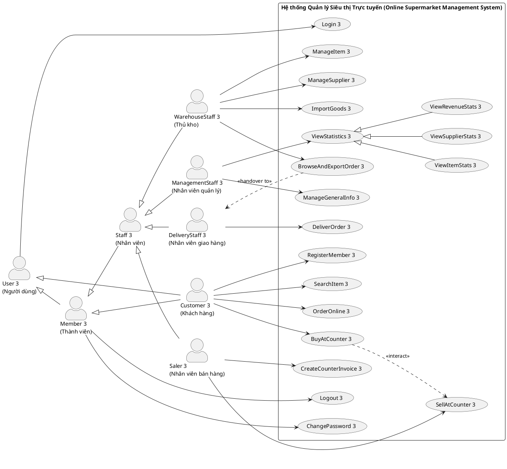
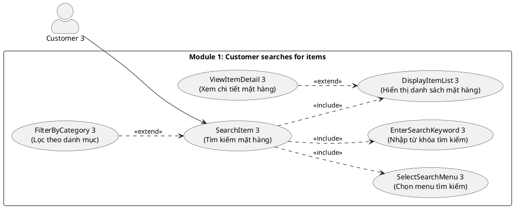
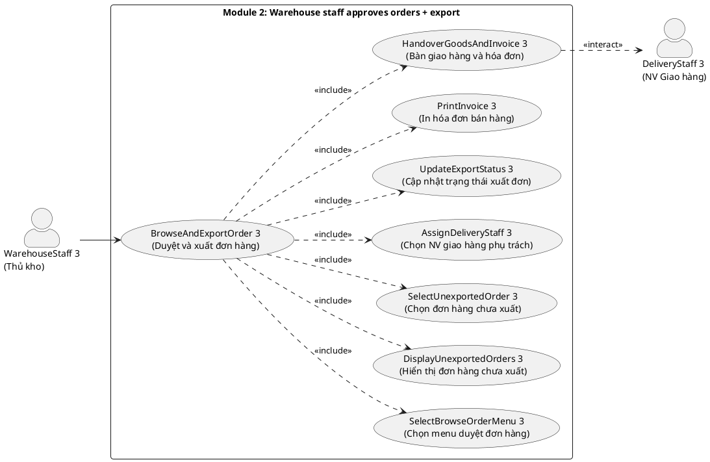
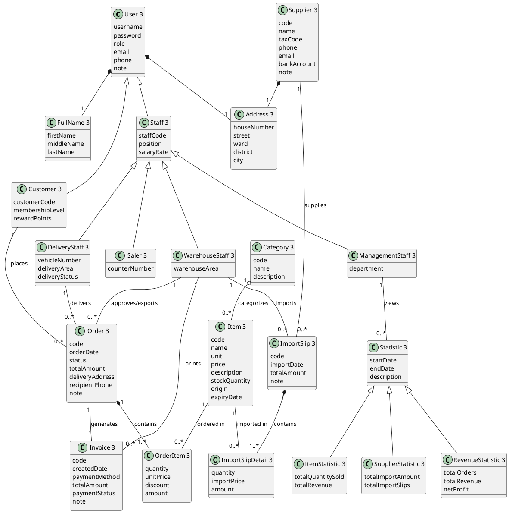
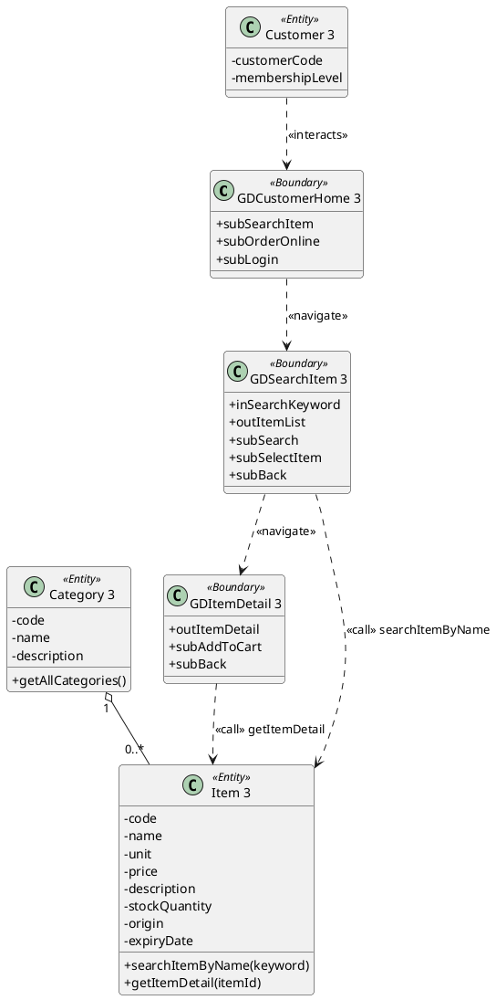
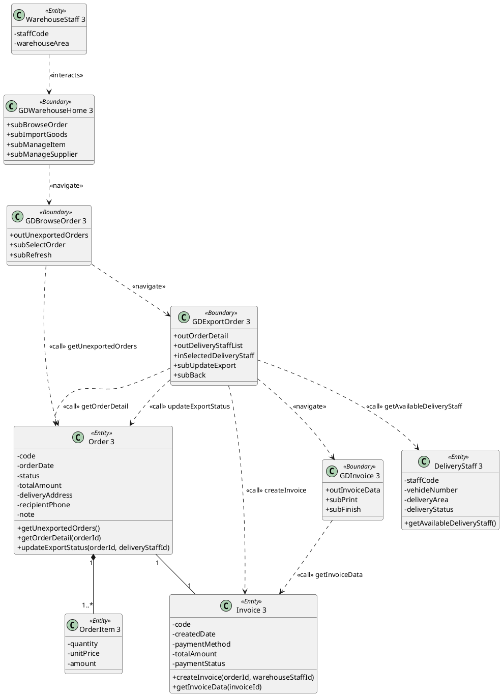
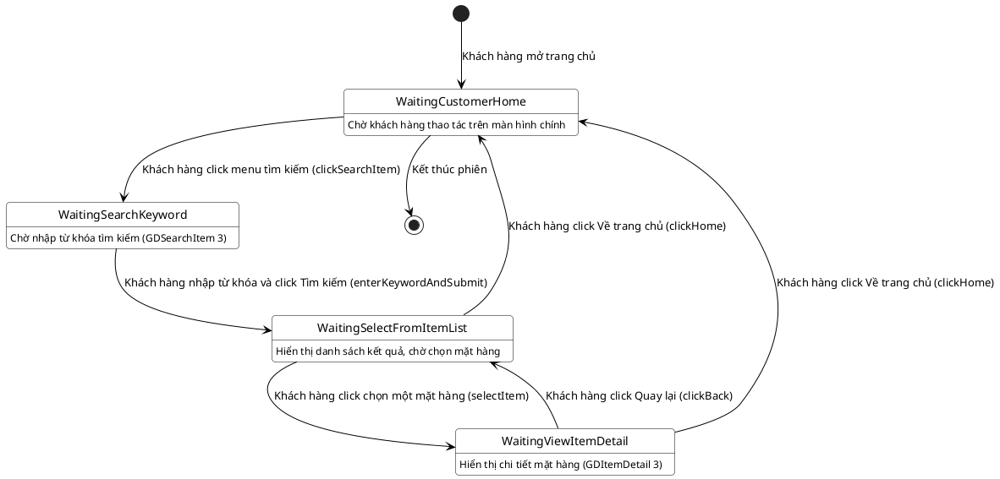
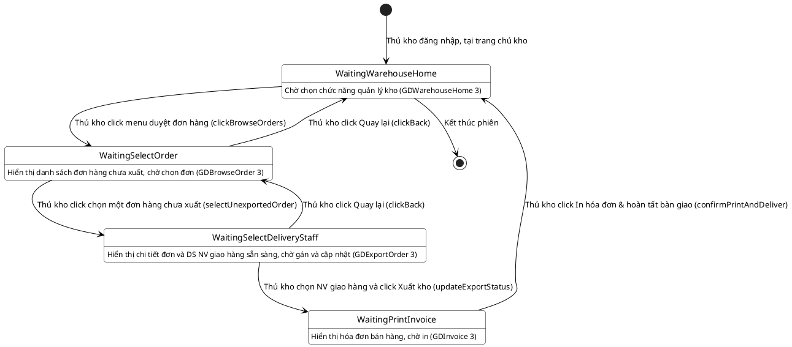

# HỌC VIỆN CÔNG NGHỆ BƯU CHÍNH VIỄN THÔNG
## KHOA CÔNG NGHỆ THÔNG TIN
### BÁO CÁO BÀI TẬP LỚN PHÂN TÍCH VÀ THIẾT KẾ HỆ THỐNG THÔNG TIN (PTTK)

---
**ĐỀ TÀI SỐ 09:** ONLINE SUPERMARKET MANAGEMENT SYSTEM (HỆ THỐNG QUẢN LÝ SIÊU THỊ TRỰC TUYẾN)  
**Sinh viên thực hiện:** NGUYỄN ĐẠI DŨNG  
**Mã sinh viên:** D23DCVT103 (Số đuôi quy định: **3**)  
**Lớp:** D23CQVT01-B  
**Tên file tài liệu nộp:** `09D23DCVT103.docx`  
**Quy ước đặt tên đề bài:**  
- Tên Use Case: Tiếng Anh + 1 số cuối mã sinh viên (ví dụ: `SearchItem 3`, `BrowseAndExportOrder 3`, `Login 3`)  
- Tên Lớp (Class): Tiếng Anh + 1 số cuối mã sinh viên (ví dụ: `Item 3`, `Customer 3`, `Order 3`, `WarehouseStaff 3`, `Invoice 3`)  
---

## MỤC LỤC
- [ASSIGNMENT 1: THU THẬP YÊU CẦU & MÔ HÌNH HÓA USE CASE](#assignment-1)
  - [1.1. Lập bảng từ khóa (Glossary List) theo mẫu](#11-lap-bang-tu-khoa-glossary-list-theo-mau)
  - [1.2. Mô tả hệ thống bằng ngôn ngữ tự nhiên (5 bước chuẩn)](#12-mo-ta-he-thong-bang-ngon-ngu-tu-nhien-5-buoc-chuan)
  - [1.3. Biểu đồ Use Case tổng quan & Mô tả Use Case](#13-bieu-do-use-case-tong-quan--mo-ta-use-case)
  - [1.4. Biểu đồ Use Case chi tiết & Mô tả Use Case cho 2 Module](#14-bieu-do-use-case-chi-tiet--mo-ta-use-case-cho-2-module)
- [ASSIGNMENT 2: KỊCH BẢN USE CASE & MÔ HÌNH HÓA LỚP THỰC THỂ HỆ THỐNG](#assignment-2)
  - [2.1. Viết Scenario (Kịch bản) cho 2 Module theo chuẩn giáo trình](#21-viet-scenario-kich-ban-cho-2-module-theo-chuan-giao-trinh)
  - [2.2. Dựng sơ đồ lớp thực thể của HỆ THỐNG theo 5 bước phương pháp trích danh từ](#22-dung-so-do-lop-thuc-the-cua-he-thong-theo-5-buoc-phuong-phap-trich-danh-tu)
- [ASSIGNMENT 3: THIẾT KẾ PHÂN TÍCH TĨNH & HOẠT ĐỘNG CHI TIẾT MODUL](#assignment-3)
  - [3.1. Trích và vẽ biểu đồ lớp cho 2 Module (Static Analysis Class Diagram)](#31-trich-va-ve-bieu-do-lop-cho-2-module-static-analysis-class-diagram)
  - [3.2. Biểu đồ chuyển trạng thái (State Diagram) cho 2 Module](#32-bieu-do-chuyen-trang-thai-state-diagram-cho-2-module)
  - [3.3. Viết kịch bản chi tiết (ver 2.0) cho 2 Module](#33-viet-kich-ban-chi-tiet-ver-20-cho-2-module)
- [ASSIGNMENT 4: THIẾT KẾ HOẠT ĐỘNG (COMMUNICATION DIAGRAM) & TỔNG HỢP TOÀN BỘ PHA PHÂN TÍCH](#assignment-4)
  - [4.1. Biểu đồ giao tiếp (Communication Diagram) cho 2 Module](#41-bieu-do-giao-tiep-communication-diagram-cho-2-module)
  - [4.2. Bảng ma trận truy vết (Traceability Matrix) & Tổng kết pha phân tích](#42-bang-ma-tran-truy-vet-traceability-matrix--tong-ket-pha-phan-tich)

---

# ASSIGNMENT 1: THU THẬP YÊU CẦU & MÔ HÌNH HÓA USE CASE

## 1.1. Lập bảng từ khóa (Glossary List) theo mẫu
Theo quy trình tại Mục 3.1.1 của giáo trình, quá trình tìm hiểu lĩnh vực chuyên môn gồm 3 bước: Liệt kê từ khóa (brainstorming), Phân nhóm từ khóa, và Lập bảng giải thích thuật ngữ chuyên môn.

### Bước 1 & 2: Phân nhóm các từ khóa chuyên môn (3 nhóm)

| Nhóm 1: Con người (Actors) | Nhóm 2: Hoạt động của con người (Activities) | Nhóm 3: Vật, đối tượng xử lý (Entities/Concepts) |
| :--- | :--- | :--- |
| - Người dùng (`User 3`) - Thành viên (`Member 3`) - Khách hàng (`Customer 3`) - Nhân viên (`Staff 3`) - Thủ kho (`WarehouseStaff 3`) - NV bán hàng (`Saler 3`) - NV quản lý (`ManagementStaff 3`) - NV giao hàng (`DeliveryStaff 3`) - Nhà cung cấp (`Supplier 3`) | - Đăng nhập (`Login 3`) - Đăng xuất (`Logout 3`) - Đổi mật khẩu (`ChangePassword 3`) - Cập nhật thông tin (`UpdateProfile 3`) - Đăng ký thành viên (`RegisterMember 3`) - Tìm kiếm mặt hàng (`SearchItem 3`) - Xem chi tiết mặt hàng (`ViewItemDetail 3`) - Đặt hàng online (`OrderOnline 3`) - Mua tại quầy (`BuyAtCounter 3`) - Bán hàng tại quầy (`SellAtCounter 3`) - Tạo hóa đơn tại quầy (`CreateCounterInvoice 3`) - Nhập hàng từ NCC (`ImportGoods 3`) - Quản lý mặt hàng (`ManageItem 3`) - Quản lý NCC (`ManageSupplier 3`) - Duyệt & xuất đơn hàng (`BrowseAndExportOrder 3`) - In hóa đơn bán hàng (`PrintInvoice 3`) - Giao hàng tận nơi (`DeliverOrder 3`) - Xem thống kê (`ViewStatistics 3`) - Xem TK mặt hàng (`ViewItemStats 3`) - Xem TK nhà cung cấp (`ViewSupplierStats 3`) - Xem TK doanh thu (`ViewRevenueStats 3`) | - Siêu thị (`Supermarket 3`) - Kho hàng (`Warehouse 3`) - Quầy thu ngân (`CheckoutCounter 3`) - Mặt hàng / Hàng hóa (`Item 3`) - Danh mục mặt hàng (`Category 3`) - Đơn vị tính (`Unit 3`) - Giá bán (`Price 3`) - Số lượng tồn kho (`StockQuantity 3`) - Mô tả mặt hàng (`Description 3`) - Nhà cung cấp (`Supplier 3`) - Đơn nhập hàng (`ImportSlip 3`) - Chi tiết đơn nhập (`ImportSlipDetail 3`) - Đơn đặt hàng (`Order 3`) - Trạng thái đơn hàng (`OrderStatus 3`) - Chi tiết đơn hàng (`OrderItem 3`) - Hóa đơn (`Invoice 3`) - Phương thức thanh toán (`PaymentMethod 3`) - Thống kê mặt hàng (`ItemStatistic 3`) - Thống kê nhà cung cấp (`SupplierStatistic 3`) - Thống kê doanh thu (`RevenueStatistic 3`) - Họ và tên (`FullName 3`) - Địa chỉ (`Address 3`) |

### Bước 3: Bảng giải thích thuật ngữ chuyên môn chi tiết (Glossary Table)

| TT | Tên Tiếng Việt | Tiếng Anh (Kèm số 3) | Giải thích ngữ nghĩa nghiệp vụ chi tiết |
| :---: | :--- | :--- | :--- |
| 1 | Thành viên | `Member 3` | Người dùng có tài khoản đã đăng ký hợp lệ và được cấp quyền đăng nhập vào hệ thống siêu thị để thực hiện các chức năng tương ứng với vai trò của mình. |
| 2 | Người dùng | `User 3` | Khái niệm chung chỉ bất kỳ tác nhân nào tương tác với hệ thống (bao gồm cả khách vãng lai và thành viên đã có tài khoản). |
| 3 | Khách hàng | `Customer 3` | Người mua sắm hàng hóa tại siêu thị, có thể đăng ký tài khoản thành viên, tìm kiếm mặt hàng, đặt mua online hoặc mua trực tiếp tại quầy thu ngân. |
| 4 | Nhân viên | `Staff 3` | Khái niệm lớp cha đại diện cho toàn bộ đội ngũ nhân sự làm việc tại siêu thị trực tuyến, có mã nhân viên, chức vụ và mức lương. |
| 5 | Thủ kho | `WarehouseStaff 3` | Nhân viên phụ trách quản lý kho hàng: nhập hàng từ NCC, quản lý danh mục mặt hàng, NCC, duyệt đơn đặt hàng online, cập nhật trạng thái xuất kho và bàn giao hàng cho nhân viên giao hàng. |
| 6 | Nhân viên bán hàng | `Saler 3` | Nhân viên trực tiếp bán hàng tại quầy thu ngân của siêu thị, tạo hóa đơn bán hàng trực tiếp cho khách hàng mua tại chỗ. |
| 7 | Nhân viên quản lý | `ManagementStaff 3` | Cán bộ quản lý siêu thị, có thẩm quyền quản lý thông tin chung và xem các báo cáo thống kê chuyên sâu: thống kê mặt hàng, thống kê nhà cung cấp, thống kê doanh thu. |
| 8 | Nhân viên giao hàng | `DeliveryStaff 3` | Nhân viên phụ trách nhận hàng hóa kèm hóa đơn từ kho sau khi duyệt để vận chuyển và giao tận nơi cho khách hàng. |
| 9 | Nhà cung cấp | `Supplier 3` | Đơn vị hoặc đối tác cung ứng các mặt hàng, hàng hóa, nhu yếu phẩm cho siêu thị theo các hợp đồng hoặc đơn nhập hàng. |
| 10 | Đăng nhập | `Login 3` | Hoạt động xác thực danh tính người dùng bằng tên đăng nhập và mật khẩu trước khi truy cập vào các chức năng được phân quyền. |
| 11 | Đăng xuất | `Logout 3` | Hành động kết thúc phiên làm việc an toàn của người dùng khỏi hệ thống. |
| 12 | Đổi mật khẩu | `ChangePassword 3` | Hoạt động cho phép thành viên thay đổi mật khẩu đăng nhập cá nhân định kỳ. |
| 13 | Tìm kiếm mặt hàng | `SearchItem 3` | Chức năng cho phép khách hàng tra cứu danh sách các mặt hàng theo từ khóa tên mặt hàng, xem thông tin tóm tắt và chi tiết. |
| 14 | Xem chi tiết mặt hàng | `ViewItemDetail 3` | Chức năng hiển thị toàn bộ thông số chi tiết của mặt hàng được chọn (mã, tên, đơn giá, đơn vị tính, hạn sử dụng, nhà sản xuất, tồn kho, mô tả). |
| 15 | Đặt hàng online | `OrderOnline 3` | Hoạt động khách hàng chọn các mặt hàng vào giỏ hàng, xác nhận địa chỉ nhận hàng, số điện thoại và gửi đơn đặt hàng trực tuyến. |
| 16 | Duyệt đơn & Xuất kho | `BrowseAndExportOrder 3` | Quy trình thủ kho kiểm tra các đơn hàng trực tuyến chưa xuất kho, chọn nhân viên giao hàng, đổi trạng thái sang 'Đã xuất kho' và in hóa đơn. |
| 17 | In hóa đơn | `PrintInvoice 3` | Hành động xuất bản và in chứng từ hóa đơn bán hàng hợp lệ từ đơn hàng để bàn giao kèm hàng hóa cho nhân viên giao hàng. |
| 18 | Bán hàng tại quầy | `SellAtCounter 3` | Quy trình nhân viên bán hàng quét mã vạch sản phẩm, tính tiền và in hóa đơn trực tiếp cho khách mua tại siêu thị. |
| 19 | Nhập hàng từ NCC | `ImportGoods 3` | Quy trình thủ kho tạo phiếu nhập hàng, ghi nhận số lượng và đơn giá nhập từ nhà cung cấp vào kho lưu trữ. |
| 20 | Xem thống kê | `ViewStatistics 3` | Hoạt động của ban quản lý nhằm trích xuất các báo cáo tổng hợp và biểu đồ kinh doanh theo thời gian. |
| 21 | Mặt hàng / Hàng hóa | `Item 3` | Sản phẩm được bày bán hoặc lưu trữ trong siêu thị, có mã, tên, giá bán, đơn vị tính, số lượng tồn kho, hình ảnh và danh mục. |
| 22 | Danh mục mặt hàng | `Category 3` | Nhóm phân loại hàng hóa trong siêu thị (ví dụ: Thực phẩm tươi sống, Đồ uống, Hóa mỹ phẩm, Đồ gia dụng). |
| 23 | Đơn đặt hàng | `Order 3` | Chứng từ ghi nhận yêu cầu mua hàng trực tuyến của khách hàng, bao gồm ngày đặt, danh sách mặt hàng, địa chỉ giao, tổng tiền và trạng thái xử lý. |
| 24 | Hóa đơn | `Invoice 3` | Chứng từ kế toán chính thức ghi nhận giao dịch thanh toán thành công giữa khách hàng và siêu thị. |
| 25 | Đơn nhập hàng | `ImportSlip 3` | Phiếu nhập kho ghi nhận các mặt hàng được nhập vào siêu thị từ nhà cung cấp kèm giá nhập và số lượng thực tế. |

## 1.2. Mô tả hệ thống bằng ngôn ngữ tự nhiên (5 bước chuẩn)
Thực hiện đầy đủ 5 bước theo phương pháp chuẩn tại Mục 3.1.2 của giáo trình:

### Bước 1: Mục đích của hệ thống
Hệ thống phần mềm quản lý siêu thị trực tuyến (**Online Supermarket Management System**) được xây dựng nhằm cung cấp giải pháp kinh doanh bán lẻ đa kênh toàn diện. Hệ thống cho phép khách hàng tra cứu tìm kiếm mặt hàng và đặt mua trực tuyến hoặc mua hàng trực tiếp tại quầy; nhân viên bán hàng thực hiện tính tiền nhanh chóng tại quầy; nhân viên thủ kho quản lý xuất nhập tồn, nhập hàng từ nhà cung cấp, kiểm duyệt và xuất đơn hàng trực tuyến để bàn giao cho nhân viên giao hàng; ban quản lý theo dõi sát sao tình hình kinh doanh thông qua các báo cáo thống kê chuyên sâu về mặt hàng, nhà cung cấp và doanh thu.

### Bước 2: Phạm vi hệ thống (Actors và phân quyền chức năng)
Những người dùng được phép truy cập vào hệ thống và danh mục chức năng tương ứng bao gồm:
- **Thành viên hệ thống (`Member 3` / `User 3`):**
  - Đăng nhập (`Login 3`), Đăng xuất (`Logout 3`), Đổi mật khẩu cá nhân (`ChangePassword 3`), Cập nhật hồ sơ cá nhân (`UpdateProfile 3`).
- **Khách hàng (`Customer 3`):**
  - Đăng ký tài khoản thành viên (`RegisterMember 3`).
  - Tìm kiếm mặt hàng theo từ khóa tên (`SearchItem 3`).
  - Xem chi tiết mặt hàng (`ViewItemDetail 3`).
  - Đặt hàng trực tuyến (`OrderOnline 3`).
  - Mua hàng trực tiếp tại quầy thanh toán (`BuyAtCounter 3`).
- **Nhân viên bán hàng (`Saler 3`):**
  - Thực hiện các chức năng thành viên.
  - Bán hàng tại quầy cho khách hàng (`SellAtCounter 3`).
  - Tạo và in hóa đơn thanh toán trực tiếp tại quầy (`CreateCounterInvoice 3`).
- **Nhân viên thủ kho (`WarehouseStaff 3`):**
  - Thực hiện các chức năng thành viên.
  - Nhập hàng từ các nhà cung cấp (`ImportGoods 3`).
  - Quản lý danh mục mặt hàng: thêm mới, xóa, sửa thông tin mặt hàng (`ManageItem 3`).
  - Quản lý danh bạ nhà cung cấp: thêm, xóa, sửa thông tin đối tác cung ứng (`ManageSupplier 3`).
  - Duyệt đơn đặt hàng trực tuyến, cập nhật trạng thái xuất kho và bàn giao cho nhân viên giao hàng (`BrowseAndExportOrder 3`).
  - In hóa đơn bán hàng cho các đơn hàng xuất kho (`PrintInvoice 3`).
- **Nhân viên giao hàng (`DeliveryStaff 3`):**
  - Tiếp nhận kiện hàng và hóa đơn từ thủ kho, giao hàng đến địa chỉ người nhận và cập nhật trạng thái giao hàng (`DeliverOrder 3`).
- **Nhân viên quản lý (`ManagementStaff 3`):**
  - Thiết lập thông tin tham số chung của siêu thị (`ManageGeneralInfo 3`).
  - Xem các báo cáo thống kê kinh doanh (`ViewStatistics 3`): Thống kê mặt hàng bán chạy (`ViewItemStats 3`), Thống kê nhà cung cấp (`ViewSupplierStats 3`), Thống kê doanh thu theo thời gian (`ViewRevenueStats 3`).

### Bước 3: Hoạt động nghiệp vụ của các chức năng (Mô tả chi tiết)

#### 1. Module 1: Khách hàng tìm kiếm mặt hàng (Customer searches for items - `SearchItem 3`)
Khách hàng truy cập vào hệ thống siêu thị -> chọn menu tìm kiếm mặt hàng -> nhập từ khóa tên mặt hàng cần tìm vào ô tìm kiếm -> hệ thống tiến hành truy vấn cơ sở dữ liệu và hiển thị danh sách các mặt hàng có tên chứa từ khóa đã nhập (gồm mã mặt hàng, tên mặt hàng, đơn vị tính, đơn giá, hình ảnh thu nhỏ, trạng thái còn hàng) -> Khách hàng click vào một mặt hàng trong danh sách để xem chi tiết -> Hệ thống hiển thị toàn bộ thông tin chi tiết của mặt hàng (mã, tên, đơn giá, đơn vị tính, số lượng tồn kho, nhà sản xuất, hạn sử dụng, thông số kỹ thuật, mô tả chi tiết sản phẩm). Khách hàng có thể quay lại danh sách hoặc chọn đưa vào giỏ hàng.

#### 2. Module 2: Thủ kho duyệt và xuất đơn hàng online (Warehouse staff approves orders + export - `BrowseAndExportOrder 3`)
Thủ kho đăng nhập vào hệ thống -> chọn menu duyệt đơn hàng trực tuyến -> hệ thống truy xuất và hiển thị danh sách các đơn đặt hàng online đang ở trạng thái chưa xuất kho (mã đơn hàng, ngày đặt, tên khách hàng, địa chỉ nhận hàng, số điện thoại, tổng tiền, trạng thái) -> Thủ kho chọn một đơn hàng chưa xuất từ danh sách để kiểm tra -> Hệ thống hiển thị chi tiết các mặt hàng trong đơn, số lượng đặt, vị trí lưu kho tương ứng và danh sách các nhân viên giao hàng đang sẵn sàng nhận việc -> Thủ kho chọn nhân viên giao hàng phụ trách -> Thủ kho bấm xác nhận xuất kho -> Hệ thống cập nhật trạng thái đơn hàng sang 'Đã xuất kho' (hoặc 'Đang giao'), đồng thời tự động khởi tạo hóa đơn bán hàng hợp lệ -> Hệ thống thực hiện lệnh in hóa đơn bán hàng ra máy in -> Thủ kho lấy hàng hóa thực tế từ kho, đóng gói và bàn giao toàn bộ hàng hóa kèm theo hóa đơn đã in cho nhân viên giao hàng mang đi giao.

#### 3. Chức năng Nhập hàng từ nhà cung cấp (`ImportGoods 3`)
Thủ kho đăng nhập -> chọn chức năng nhập hàng -> chọn nhà cung cấp từ danh sách đối tác -> tạo phiếu nhập hàng mới -> nhập danh sách các mặt hàng nhập kho, số lượng thực nhận và đơn giá nhập -> kiểm tra tổng tiền phiếu nhập và click lưu -> hệ thống ghi nhận phiếu nhập kho và tự động cộng dồn số lượng tồn kho của từng mặt hàng.

#### 4. Chức năng Quản lý mặt hàng (`ManageItem 3`)
Thủ kho vào menu quản lý mặt hàng -> hệ thống hiển thị danh sách mặt hàng hiện tại -> thủ kho có thể thêm mặt hàng mới (nhập tên, đơn vị tính, giá bán, danh mục, mô tả), sửa thông tin mặt hàng hiện có, hoặc vô hiệu hóa/xóa mặt hàng khi ngừng kinh doanh.

#### 5. Chức năng Quản lý nhà cung cấp (`ManageSupplier 3`)
Thủ kho vào menu quản lý nhà cung cấp -> hệ thống hiển thị danh sách NCC -> thủ kho có thể thêm mới đối tác (tên, mã số thuế, địa chỉ, số điện thoại, email, tài khoản ngân hàng), chỉnh sửa thông tin hoặc xóa đối tác không còn hợp tác.

#### 6. Chức năng Bán hàng tại quầy (`SellAtCounter 3`)
Nhân viên bán hàng đăng nhập -> mở màn hình bán lẻ tại quầy -> quét mã vạch hoặc nhập mã các mặt hàng khách mua -> hệ thống tự tính tổng tiền, chiết khấu và tiền thừa -> NV bấm thanh toán -> hệ thống in hóa đơn và trừ tồn kho mặt hàng tương ứng.

#### 7. Chức năng Xem thống kê báo cáo (`ViewStatistics 3`)
Quản lý đăng nhập -> chọn menu báo cáo thống kê -> chọn loại thống kê mong muốn (Thống kê mặt hàng, Thống kê nhà cung cấp, hoặc Thống kê doanh thu) -> chọn khoảng thời gian (từ ngày... đến ngày...) -> hệ thống trích xuất dữ liệu, tính toán và hiển thị bảng biểu số liệu tổng hợp cùng đồ thị phân tích.

### Bước 4: Thông tin các đối tượng cần xử lý, quản lý
- **Nhóm thông tin con người:**
  - `User 3`: username, password, email, phone, role, note.
  - `FullName 3`: firstName, middleName, lastName.
  - `Address 3`: houseNumber, street, ward, district, city.
  - `Customer 3` (kế thừa `User 3`): customerCode, membershipLevel, rewardPoints.
  - `Staff 3` (kế thừa `User 3`): staffCode, position, salaryRate.
  - `WarehouseStaff 3` (kế thừa `Staff 3`): warehouseArea.
  - `Saler 3` (kế thừa `Staff 3`): counterNumber.
  - `ManagementStaff 3` (kế thừa `Staff 3`): department.
  - `DeliveryStaff 3` (kế thừa `Staff 3`): vehicleNumber, deliveryArea, deliveryStatus.
  - `Supplier 3`: code, name, taxCode, phone, email, bankAccount, note.
- **Nhóm thông tin cơ sở vật chất, tổ chức:**
  - `Supermarket 3`: code, name, address, phone.
  - `Warehouse 3`: code, name, location, capacity.
  - `CheckoutCounter 3`: counterNumber, location, status.
- **Nhóm thông tin chuyên môn, vận hành:**
  - `Category 3`: code, name, description.
  - `Item 3`: code, name, unit, price, description, stockQuantity, origin, expiryDate.
  - `ImportSlip 3`: code, importDate, totalAmount, note.
  - `ImportSlipDetail 3`: quantity, importPrice, amount.
  - `Order 3`: code, orderDate, status, totalAmount, deliveryAddress, recipientPhone, note.
  - `OrderItem 3`: quantity, unitPrice, discount, amount.
  - `Invoice 3`: code, createdDate, paymentMethod, totalAmount, paymentStatus, note.
- **Nhóm thông tin báo cáo thống kê:**
  - `Statistic 3`: startDate, endDate, description.
  - `ItemStatistic 3`: totalQuantitySold, totalRevenue.
  - `SupplierStatistic 3`: totalImportAmount, totalImportSlips.
  - `RevenueStatistic 3`: totalOrders, totalRevenue, netProfit.

### Bước 5: Quan hệ số lượng giữa các đối tượng
- Mỗi người dùng (`User 3`) có duy nhất 1 họ và tên (`FullName 3`) và 1 địa chỉ (`Address 3`) (1 - 1).
- Mỗi nhà cung cấp (`Supplier 3`) có duy nhất 1 địa chỉ (`Address 3`) (1 - 1).
- Một danh mục (`Category 3`) có nhiều mặt hàng (`Item 3`), mỗi mặt hàng thuộc về 1 danh mục chính (1 - n).
- Một nhà cung cấp có thể cung cấp nhiều đơn nhập hàng (`ImportSlip 3`) (1 - n).
- Một thủ kho có thể tạo và quản lý nhiều đơn nhập hàng (1 - n).
- Một đơn nhập hàng có nhiều dòng chi tiết nhập hàng (`ImportSlipDetail 3`) (1 - n, quan hệ composition).
- Một mặt hàng có thể xuất hiện trong nhiều chi tiết đơn nhập hàng (1 - n).
- Một khách hàng có thể đặt nhiều đơn đặt hàng (`Order 3`) (1 - n).
- Một đơn đặt hàng có nhiều dòng chi tiết mặt hàng (`OrderItem 3`) (1 - n, quan hệ composition).
- Một mặt hàng có thể nằm trong nhiều chi tiết đơn đặt hàng (1 - n).
- Một thủ kho có thể duyệt và xuất nhiều đơn đặt hàng (1 - n).
- Một nhân viên giao hàng có thể phụ trách vận chuyển nhiều đơn đặt hàng (1 - n).
- Một đơn đặt hàng sau khi xuất kho sinh ra duy nhất 1 hóa đơn bán lẻ (`Invoice 3`) (1 - 1).
- Một thủ kho có thể thực hiện in nhiều hóa đơn bán hàng (1 - n).
- Một nhân viên quản lý có thể xem nhiều báo cáo thống kê (`Statistic 3`) (1 - n).

## 1.3. Biểu đồ Use Case tổng quan & Mô tả Use Case
Biểu đồ Use Case tổng quan mô tả đầy đủ các tác nhân và chức năng hệ thống theo đúng quy ước số đuôi **3** của sinh viên D23DCVT103.

### Bảng mô tả chi tiết các Use Case tổng quan

| Tên Use Case | Actor chính | Actor phụ | Mô tả chức năng tóm tắt |
| :--- | :--- | :--- | :--- |
| `Login 3` | `User 3` | Hệ thống xác thực | Cho phép mọi người dùng đã có tài khoản (Khách hàng, Thủ kho, NV bán hàng, Quản lý, NV giao hàng) đăng nhập vào hệ thống. |
| `Logout 3` | `Member 3` | Không có | Cho phép thành viên kết thúc phiên làm việc hiện tại và thoát khỏi hệ thống an toàn. |
| `ChangePassword 3` | `Member 3` | Không có | Cho phép thành viên cập nhật lại mật khẩu cá nhân để bảo vệ tài khoản. |
| `RegisterMember 3` | `Customer 3` | Không có | Cho phép khách hàng đăng ký tài khoản thành viên mới để hưởng ưu đãi và đặt hàng trực tuyến. |
| `SearchItem 3` | `Customer 3` | Không có | Cho phép khách hàng tìm kiếm các mặt hàng theo từ khóa tên sản phẩm và xem chi tiết. |
| `OrderOnline 3` | `Customer 3` | Không có | Cho phép khách hàng chọn mặt hàng vào giỏ và đặt hàng trực tuyến giao tận nơi. |
| `BuyAtCounter 3` | `Customer 3` | Saler 3 | Khách hàng mua hàng trực tiếp tại quầy thanh toán của siêu thị. |
| `SellAtCounter 3` | `Saler 3` | Customer 3 | Cho phép nhân viên thu ngân thanh toán tiền và tạo hóa đơn cho khách mua tại quầy. |
| `CreateCounterInvoice 3` | `Saler 3` | Customer 3 | Tạo và in hóa đơn bán lẻ trực tiếp tại quầy. |
| `ImportGoods 3` | `WarehouseStaff 3` | Supplier 3 | Cho phép thủ kho tạo phiếu nhập hàng, ghi nhận hàng nhập từ nhà cung cấp vào kho. |
| `ManageItem 3` | `WarehouseStaff 3` | Không có | Cho phép thủ kho quản lý thông tin các mặt hàng (thêm mới, sửa, xóa, cập nhật tồn kho). |
| `ManageSupplier 3` | `WarehouseStaff 3` | Không có | Cho phép thủ kho quản lý danh bạ thông tin các nhà cung cấp (thêm, sửa, xóa). |
| `BrowseAndExportOrder 3` | `WarehouseStaff 3` | DeliveryStaff 3 | Cho phép thủ kho duyệt các đơn hàng online chưa xuất kho, chọn nhân viên giao hàng, cập nhật trạng thái đơn, in hóa đơn và bàn giao hàng. |
| `DeliverOrder 3` | `DeliveryStaff 3` | Customer 3 | Cho phép nhân viên giao hàng nhận hàng và hóa đơn từ thủ kho, vận chuyển đến khách và cập nhật kết quả giao. |
| `ManageGeneralInfo 3` | `ManagementStaff 3` | Không có | Cho phép quản lý thiết lập các tham số hệ thống chung, thông tin siêu thị, ca làm việc. |
| `ViewStatistics 3` | `ManagementStaff 3` | Không có | Use case tổng quát cho phép quản lý tra cứu các loại báo cáo thống kê. |
| `ViewItemStats 3` | `ManagementStaff 3` | Không có | Cho phép quản lý xem thống kê mặt hàng bán chạy, tồn kho, tỷ lệ tiêu thụ. |
| `ViewSupplierStats 3` | `ManagementStaff 3` | Không có | Cho phép quản lý xem thống kê nhà cung cấp theo sản lượng nhập và chi phí. |
| `ViewRevenueStats 3` | `ManagementStaff 3` | Không có | Cho phép quản lý xem báo cáo doanh thu theo mốc thời gian (ngày, tháng, quý, năm). |

## 1.4. Biểu đồ Use Case chi tiết & Mô tả Use Case cho 2 Module

### 1. Module 1: Customer searches for items (`SearchItem 3`)
Use case tìm kiếm mặt hàng được phân rã chi tiết thành các use case con tương ứng với các bước tương tác giao diện của khách hàng.

#### Bảng mô tả các Use Case con của Module 1

| Tên Use Case | Actor | Mô tả chức năng chi tiết |
| :--- | :--- | :--- |
| `SearchItem 3` | `Customer 3` | Use case chính cho phép khách hàng tra cứu tìm kiếm mặt hàng theo từ khóa và xem chi tiết. |
| `SelectSearchMenu 3` | `Customer 3` | Khách hàng chọn mục 'Tìm kiếm mặt hàng' trên thanh điều hướng hoặc menu hệ thống. |
| `EnterSearchKeyword 3` | `Customer 3` | Khách hàng nhập chuỗi ký tự từ khóa đại diện cho tên mặt hàng muốn tìm vào ô tìm kiếm. |
| `DisplayItemList 3` | `Hệ thống` | Hệ thống tra cứu cơ sở dữ liệu và hiển thị danh sách các mặt hàng có tên chứa từ khóa tìm kiếm. |
| `ViewItemDetail 3` | `Customer 3` | Use case mở rộng (extend): khi khách hàng click vào một mặt hàng trong danh sách, hệ thống hiển thị chi tiết toàn diện của mặt hàng đó. |
| `FilterByCategory 3` | `Customer 3` | Use case mở rộng (extend): cho phép khách hàng thu hẹp phạm vi tìm kiếm theo phân loại danh mục hàng hóa. |

### 2. Module 2: Warehouse staff approves orders + export (`BrowseAndExportOrder 3`)
Use case duyệt và xuất đơn hàng trực tuyến của thủ kho bàn giao cho nhân viên giao hàng được phân rã chi tiết như sau:

#### Bảng mô tả các Use Case con của Module 2

| Tên Use Case | Actor | Mô tả chức năng chi tiết |
| :--- | :--- | :--- |
| `BrowseAndExportOrder 3` | `WarehouseStaff 3` | Use case chính cho phép thủ kho duyệt đơn hàng online, chọn NV giao hàng, cập nhật trạng thái xuất kho và in hóa đơn bàn giao. |
| `SelectBrowseOrderMenu 3` | `WarehouseStaff 3` | Thủ kho bấm chọn menu chức năng 'Duyệt & Xuất đơn hàng' trên màn hình quản lý kho. |
| `DisplayUnexportedOrders 3` | `Hệ thống` | Hệ thống truy vấn cơ sở dữ liệu và hiển thị toàn bộ danh sách các đơn hàng online đang ở trạng thái chưa xuất kho (Đã đặt / Chờ duyệt). |
| `SelectUnexportedOrder 3` | `WarehouseStaff 3` | Thủ kho chọn một đơn hàng cụ thể từ danh sách để xem chi tiết các mặt hàng và chuẩn bị xuất kho. |
| `AssignDeliveryStaff 3` | `WarehouseStaff 3` | Thủ kho chọn nhân viên giao hàng đang sẵn sàng (active) từ danh sách để phân công giao đơn hàng này. |
| `UpdateExportStatus 3` | `WarehouseStaff 3` | Hệ thống chuyển trạng thái đơn hàng sang 'Đã xuất kho' (hoặc 'Đang giao') và lưu thời điểm xuất kho. |
| `PrintInvoice 3` | `WarehouseStaff 3` | Hệ thống tạo hóa đơn bán hàng tương ứng với đơn hàng và in hóa đơn ra máy in. |
| `HandoverGoodsAndInvoice 3` | `WarehouseStaff 3` | Thủ kho bàn giao kiện hàng thực tế cùng với hóa đơn đã in cho nhân viên giao hàng phụ trách mang đi. |

# ASSIGNMENT 2: KỊCH BẢN USE CASE & MÔ HÌNH HÓA LỚP THỰC THỂ HỆ THỐNG

## 2.1. Viết Scenario (Kịch bản) cho 2 Module theo chuẩn giáo trình
Áp dụng mẫu kịch bản chi tiết chuẩn tại Mục 3.2.1 của giáo trình (bao gồm Tên UC, Actor, Tiền điều kiện, Hậu điều kiện, Kịch bản chính từng bước kèm dữ liệu hiển thị, và Kịch bản ngoại lệ):

### 1. Kịch bản cho Module 1: Khách hàng tìm kiếm mặt hàng (`SearchItem 3`)

| Mục | Nội dung chi tiết |
| :--- | :--- |
| **Use Case** | `SearchItem 3` (Khách hàng tìm kiếm mặt hàng) |
| **Actor** | Khách hàng (`Customer 3`) |
| **Tiền điều kiện** | Hệ thống hoạt động bình thường, khách hàng đã truy cập vào website siêu thị (không bắt buộc đăng nhập). |
| **Hậu điều kiện** | Khách hàng xem được thông tin chi tiết đầy đủ của mặt hàng mong muốn. |
| **Kịch bản chính** | **1.** Từ giao diện trang chủ siêu thị (`GDCustomerHome 3`), khách hàng bấm chọn vào thanh/menu tìm kiếm. **2.** Hệ thống hiển thị giao diện tìm kiếm mặt hàng (`GDSearchItem 3`) với ô nhập từ khóa tìm kiếm và các bộ lọc danh mục. **3.** Khách hàng nhập từ khóa tên sản phẩm (ví dụ: *"Sữa tươi"*) vào ô tìm kiếm và bấm nút **"Tìm kiếm"**. **4.** Hệ thống tiếp nhận từ khóa, thực hiện truy vấn cơ sở dữ liệu và hiển thị danh sách các mặt hàng có tên chứa từ khóa:  *Bảng danh sách kết quả tìm kiếm:* - **Mã MH:** `MH001` \| **Tên mặt hàng:** Sữa tươi tiệt trùng Vinamilk 1L \| **ĐVT:** Hộp \| **Đơn giá:** 36.000 đ \| **Tồn kho:** 150 \| **Hành động:** [Xem chi tiết] - **Mã MH:** `MH002` \| **Tên mặt hàng:** Sữa tươi ít đường TH True Milk 1L \| **ĐVT:** Hộp \| **Đơn giá:** 38.000 đ \| **Tồn kho:** 85 \| **Hành động:** [Xem chi tiết] - **Mã MH:** `MH005` \| **Tên mặt hàng:** Sữa chua uống men sống Vinamilk \| **ĐVT:** Lốc \| **Đơn giá:** 28.000 đ \| **Tồn kho:** 200 \| **Hành động:** [Xem chi tiết]  **5.** Khách hàng click chọn vào mặt hàng *"Sữa tươi tiệt trùng Vinamilk 1L"* (`MH001`) để xem thông tin cụ thể. **6.** Hệ thống chuyển sang giao diện chi tiết mặt hàng (`GDItemDetail 3`) và hiển thị đầy đủ thông số:  *Bảng thông tin chi tiết mặt hàng:* - **Mã sản phẩm:** `MH001` - **Tên sản phẩm:** Sữa tươi tiệt trùng nguyên chất Vinamilk 1L - **Danh mục:** Sữa & Sản phẩm từ sữa - **Nhà sản xuất / Cung cấp:** Công ty Cổ phần Sữa Việt Nam (Vinamilk) - **Đơn vị tính:** Hộp (1000ml) - **Đơn giá bán lẻ:** 36.000 VNĐ - **Số lượng tồn khả dụng:** 150 hộp - **Ngày sản xuất:** 15/09/2026 \| **Hạn sử dụng:** 15/03/2027 - **Mô tả chi tiết:** Sữa tươi nguyên chất 100% tiệt trùng theo công nghệ hiện đại, giàu canxi, vitamin D3, bảo quản nơi khô ráo thoáng mát.  **7.** Khách hàng xem xong thông tin và có thể chọn [Quay lại danh sách] hoặc [Thêm vào giỏ hàng]. |
| **Ngoại lệ** | - **Bước 4a:** Không tìm thấy mặt hàng nào phù hợp với từ khóa: Hệ thống hiển thị thông báo *"Không tìm thấy sản phẩm nào khớp với từ khóa đã nhập. Vui lòng thử từ khóa khác!"* và giữ nguyên ô tìm kiếm. - **Bước 4b:** Khách hàng để trống ô từ khóa và bấm tìm kiếm: Hệ thống cảnh báo *"Vui lòng nhập từ khóa tìm kiếm!"*. |

### 2. Kịch bản cho Module 2: Thủ kho duyệt và xuất đơn hàng (`BrowseAndExportOrder 3`)

| Mục | Nội dung chi tiết |
| :--- | :--- |
| **Use Case** | `BrowseAndExportOrder 3` (Thủ kho duyệt đơn hàng và xuất hàng cho NV giao hàng) |
| **Actor chính** | Thủ kho (`WarehouseStaff 3`) |
| **Actor phối hợp**| Nhân viên giao hàng (`DeliveryStaff 3`) |
| **Tiền điều kiện** | Thủ kho đã đăng nhập thành công vào hệ thống quản lý kho; trong hệ thống có đơn đặt hàng online đang ở trạng thái chưa xuất kho (*"Chờ duyệt"* hoặc *"Đã đặt"*). |
| **Hậu điều kiện** | Đơn hàng được cập nhật trạng thái *"Đã xuất kho"*, hóa đơn bán hàng được in ra, kiện hàng và hóa đơn được bàn giao thành công cho NV giao hàng. |
| **Kịch bản chính** | **1.** Sau khi đăng nhập, từ màn hình chính của thủ kho (`GDWarehouseHome 3`), thủ kho bấm chọn menu **"Duyệt & Xuất đơn hàng"**. **2.** Hệ thống mở giao diện duyệt đơn hàng (`GDBrowseOrder 3`), tự động truy vấn và hiển thị danh sách các đơn hàng online chưa xuất kho:  *Bảng danh sách đơn hàng chưa xuất:* - **Mã ĐH:** `DH101` \| **Ngày đặt:** 28/09/2026 08:30 \| **Khách hàng:** Lê Văn Nam \| **SĐT:** 0912345678 \| **Tổng tiền:** 350.000 đ \| **Trạng thái:** Chờ duyệt \| **Thao tác:** [Chọn duyệt] - **Mã ĐH:** `DH102` \| **Ngày đặt:** 28/09/2026 09:15 \| **Khách hàng:** Trần Thị Mai \| **SĐT:** 0987654321 \| **Tổng tiền:** 520.000 đ \| **Trạng thái:** Chờ duyệt \| **Thao tác:** [Chọn duyệt] - **Mã ĐH:** `DH105` \| **Ngày đặt:** 28/09/2026 10:00 \| **Khách hàng:** Phạm Hoàng Long \| **SĐT:** 0903112233 \| **Tổng tiền:** 180.000 đ \| **Trạng thái:** Chờ duyệt \| **Thao tác:** [Chọn duyệt]  **3.** Thủ kho click chọn đơn hàng `DH101` từ danh sách để xử lý. **4.** Hệ thống chuyển sang giao diện xuất kho đơn hàng (`GDExportOrder 3`), hiển thị chi tiết các sản phẩm cần gom trong đơn `DH101`, vị trí kho và tải danh sách các nhân viên giao hàng đang sẵn sàng làm việc (active):  *Bảng chi tiết đơn hàng DH101 & DS Nhân viên giao hàng sẵn sàng:* - Danh sách mặt hàng: 05 Hộp Sữa tươi Vinamilk 1L (Kệ A1-02); 02 Chai Dầu ăn Neptune 1L (Kệ B2-05). - Danh sách NV giao hàng sẵn sàng:   + [ ] NVGH01 - Vũ Tuấn Anh (Xe: 29B1-12345, Khu vực: Cầu Giấy)   + [x] NVGH03 - Nguyễn Minh Hoàng (Xe: 29D2-67890, Khu vực: Hà Đông - Trực tiếp phụ trách đơn `DH101`)  **5.** Thủ kho gom đủ hàng theo danh sách, tích chọn nhân viên giao hàng `NVGH03` (Nguyễn Minh Hoàng) phụ trách vận chuyển. **6.** Thủ kho bấm nút **"Cập nhật trạng thái & Xuất kho"**. **7.** Hệ thống cập nhật trạng thái đơn hàng `DH101` thành **"Đã xuất kho"** (kèm mã NV giao hàng `NVGH03` và thời điểm xuất), đồng thời tạo bản ghi hóa đơn thanh toán `HD101` và chuyển sang giao diện in hóa đơn (`GDInvoice 3`). **8.** Hệ thống gửi lệnh và máy in tiến hành in hóa đơn bán hàng `HD101` đầy đủ thông tin (Mã HĐ, ngày in, thông tin khách, chi tiết tiền, người lập hóa đơn, người giao hàng). **9.** Thủ kho đóng gói kiện hàng và bàn giao trực tiếp kiện hàng cùng hóa đơn giấy đã in cho NV giao hàng Nguyễn Minh Hoàng mang đi giao. Hệ thống thông báo hoàn tất và quay lại danh sách đơn hàng. |
| **Ngoại lệ** | - **Bước 2a:** Không có đơn hàng nào ở trạng thái chưa xuất: Hệ thống hiển thị thông báo *"Hiện tại không có đơn hàng nào cần xuất kho!"*. - **Bước 4a:** Hàng trong kho thực tế bị thiếu/hỏng so với số lượng đặt: Thủ kho chọn nút *"Báo thiếu hàng/Liên hệ khách"*, đơn hàng được chuyển sang trạng thái chờ xử lý tồn kho. - **Bước 5a:** Không có nhân viên giao hàng nào đang online/sẵn sàng: Hệ thống báo *"Chưa có nhân viên giao hàng khả dụng. Vui lòng phân công sau!"*. |

## 2.2. Dựng sơ đồ lớp thực thể của HỆ THỐNG theo 5 bước phương pháp trích danh từ
Áp dụng chặt chẽ 5 bước của phương pháp trích danh từ theo Mục 3.2.2 của giáo trình:

### Bước 1: Mô tả ngắn gọn nhưng đầy đủ hệ thống trong một đoạn văn
> "Hệ thống là một phần mềm trang web hỗ trợ quản lý siêu thị trực tuyến và bán hàng đa kênh. Trong đó, khách hàng có thể đăng ký tài khoản thành viên, tra cứu tìm kiếm các mặt hàng theo từ khóa tên, xem thông tin chi tiết từng mặt hàng về đơn giá, số lượng tồn kho, danh mục, nhà cung cấp, hoặc đặt các đơn đặt hàng trực tuyến giao tận nơi, cũng như mua hàng trực tiếp tại quầy thanh toán. Nhân viên bán hàng phụ trách bán hàng tại quầy và in hóa đơn thanh toán cho khách hàng mua trực tiếp. Nhân viên thủ kho có nhiệm vụ nhập hàng hóa từ các nhà cung cấp theo các phiếu nhập hàng ghi rõ chi tiết số lượng và giá nhập; quản lý thông tin các mặt hàng và danh bạ đối tác cung cấp; kiểm tra danh sách đơn đặt hàng online chưa xuất kho, lựa chọn nhân viên giao hàng phụ trách, cập nhật trạng thái xuất kho cho đơn hàng, in hóa đơn bán hàng hợp lệ và bàn giao kiện hàng cùng hóa đơn cho nhân viên giao hàng mang đi phát cho khách. Nhân viên quản lý có quyền thiết lập các tham số hệ thống chung và theo dõi các báo cáo thống kê chuyên sâu gồm: thống kê mặt hàng bán chạy và tồn kho, thống kê tình hình nhập hàng theo từng nhà cung cấp, và thống kê doanh thu lợi nhuận theo các mốc thời gian."

### Bước 2: Trích các danh từ xuất hiện trong đoạn văn
- **Danh từ liên quan đến con người:** Khách hàng, thành viên, tài khoản, nhân viên bán hàng, nhân viên thủ kho, nhà cung cấp, nhân viên giao hàng, nhân viên quản lý, người dùng, người nhận.
- **Danh từ liên quan đến vật chất, cơ sở, địa điểm:** Siêu thị, trang web, kho hàng, quầy thanh toán, kệ hàng, kiện hàng, xe giao hàng, địa chỉ, số điện thoại, máy in.
- **Danh từ liên quan đến nghiệp vụ và thông tin:** Mặt hàng, hàng hóa, từ khóa, tên mặt hàng, đơn giá, số lượng tồn kho, danh mục, đơn đặt hàng, chi tiết đơn hàng, trạng thái đơn hàng, phiếu nhập hàng, chi tiết đơn nhập, giá nhập, hóa đơn bán hàng, hóa đơn thanh toán, tiền thừa, chiết khấu, báo cáo thống kê, thống kê mặt hàng, thống kê nhà cung cấp, thống kê doanh thu, thời gian, doanh thu, lợi nhuận.

### Bước 3: Đánh giá và lựa chọn danh từ làm lớp thực thể hoặc thuộc tính
- **Loại bỏ các danh từ trừu tượng hoặc ngoài phạm vi:** Hệ thống, trang web, phần mềm, từ khóa, kiện hàng, máy in, tiền thừa, chiết khấu, thời gian -> Loại.
- **Danh từ đề xuất làm Lớp thực thể (Áp dụng quy tắc tên tiếng Anh + số đuôi 3):**
  - Khái niệm con người cơ sở -> Lớp trừu tượng `User 3`: username, password, email, phone, role, note.
  - Họ và tên -> Lớp `FullName 3`: firstName, middleName, lastName.
  - Địa chỉ -> Lớp `Address 3`: houseNumber, street, ward, district, city.
  - Khách hàng -> Lớp `Customer 3` (kế thừa `User 3`): customerCode, membershipLevel, rewardPoints.
  - Nhân viên -> Lớp trừu tượng `Staff 3` (kế thừa `User 3`): staffCode, position, salaryRate.
  - Thủ kho -> Lớp `WarehouseStaff 3` (kế thừa `Staff 3`): warehouseArea.
  - Nhân viên bán hàng -> Lớp `Saler 3` (kế thừa `Staff 3`): counterNumber.
  - Nhân viên quản lý -> Lớp `ManagementStaff 3` (kế thừa `Staff 3`): department.
  - Nhân viên giao hàng -> Lớp `DeliveryStaff 3` (kế thừa `Staff 3`): vehicleNumber, deliveryArea, deliveryStatus.
  - Nhà cung cấp -> Lớp `Supplier 3`: code, name, taxCode, phone, email, bankAccount, note.
  - Danh mục hàng hóa -> Lớp `Category 3`: code, name, description.
  - Mặt hàng -> Lớp `Item 3`: code, name, unit, price, description, stockQuantity, origin, expiryDate.
  - Phiếu nhập hàng -> Lớp `ImportSlip 3`: code, importDate, totalAmount, note.
  - Chi tiết phiếu nhập -> Lớp `ImportSlipDetail 3`: quantity, importPrice, amount.
  - Đơn đặt hàng -> Lớp `Order 3`: code, orderDate, status, totalAmount, deliveryAddress, recipientPhone, note.
  - Chi tiết đơn hàng -> Lớp `OrderItem 3`: quantity, unitPrice, discount, amount.
  - Hóa đơn -> Lớp `Invoice 3`: code, createdDate, paymentMethod, totalAmount, paymentStatus, note.
  - Báo cáo thống kê cơ sở -> Lớp trừu tượng `Statistic 3`: startDate, endDate, description.
  - Thống kê mặt hàng -> Lớp `ItemStatistic 3` (kế thừa `Statistic 3`): totalQuantitySold, totalRevenue.
  - Thống kê nhà cung cấp -> Lớp `SupplierStatistic 3` (kế thừa `Statistic 3`): totalImportAmount, totalImportSlips.
  - Thống kê doanh thu -> Lớp `RevenueStatistic 3` (kế thừa `Statistic 3`): totalOrders, totalRevenue, netProfit.

### Bước 4: Xác định quan hệ số lượng giữa các thực thể
- `User 3` - `FullName 3`: 1 - 1.
- `User 3` - `Address 3`: 1 - 1.
- `Supplier 3` - `Address 3`: 1 - 1.
- `Category 3` - `Item 3`: 1 - n (Một danh mục có nhiều mặt hàng).
- `WarehouseStaff 3` - `ImportSlip 3`: 1 - n (Thủ kho lập nhiều phiếu nhập).
- `Supplier 3` - `ImportSlip 3`: 1 - n (NCC cung cấp nhiều phiếu nhập).
- `ImportSlip 3` - `Item 3` là quan hệ nhiều - nhiều (n - n): Tách thành 2 quan hệ 1 - n thông qua lớp thực thể trung gian `ImportSlipDetail 3`.
- `Customer 3` - `Order 3`: 1 - n (Khách hàng đặt nhiều đơn hàng).
- `Order 3` - `Item 3` là quan hệ nhiều - nhiều (n - n): Tách thành 2 quan hệ 1 - n thông qua lớp thực thể trung gian `OrderItem 3`.
- `WarehouseStaff 3` - `Order 3`: 1 - n (Thủ kho duyệt và xuất nhiều đơn hàng).
- `DeliveryStaff 3` - `Order 3`: 1 - n (NV giao hàng vận chuyển nhiều đơn hàng).
- `Order 3` - `Invoice 3`: 1 - 1 (Mỗi đơn hàng online xuất kho gắn liền với 1 hóa đơn).
- `WarehouseStaff 3` - `Invoice 3`: 1 - n (Thủ kho in nhiều hóa đơn).
- `ManagementStaff 3` - `Statistic 3`: 1 - n (Quản lý xem nhiều báo cáo thống kê).

### Bước 5: Xác định quan hệ đối tượng giữa các thực thể
- **Quan hệ kế thừa (Generalization):**
  - `Customer 3` và `Staff 3` kế thừa từ `User 3`.
  - `WarehouseStaff 3`, `Saler 3`, `ManagementStaff 3`, `DeliveryStaff 3` kế thừa từ `Staff 3`.
  - `ItemStatistic 3`, `SupplierStatistic 3`, `RevenueStatistic 3` kế thừa từ `Statistic 3`.
- **Quan hệ hợp thành / gắn chặt (Composition):**
  - `User 3` sở hữu `FullName 3` và `Address 3` (bản quyền thông tin gắn chặt).
  - `ImportSlip 3` chứa các dòng `ImportSlipDetail 3` (nếu hủy phiếu nhập thì các chi tiết cũng bị xóa).
  - `Order 3` chứa các dòng `OrderItem 3` (các dòng chi tiết đơn hàng phụ thuộc hoàn toàn vào đơn hàng).
- **Quan hệ kết tập (Aggregation):**
  - `Category 3` chứa tập hợp các `Item 3`.
- **Quan hệ liên kết (Association):**
  - `WarehouseStaff 3` liên kết với `ImportSlip 3` và `Order 3`.
  - `Supplier 3` liên kết với `ImportSlip 3`.
  - `DeliveryStaff 3` liên kết với `Order 3`.
  - `Order 3` liên kết với `Invoice 3`.
  - `Item 3` liên kết với `ImportSlipDetail 3` và `OrderItem 3`.

### Biểu đồ lớp thực thể pha phân tích của TOÀN HỆ THỐNG (PlantUML)

# ASSIGNMENT 3: THIẾT KẾ PHÂN TÍCH TĨNH & HOẠT ĐỘNG CHI TIẾT MODUL

## 3.1. Trích và vẽ biểu đồ lớp cho 2 Module (Static Analysis Class Diagram)
Theo Mục 3.2.3 của giáo trình, quá trình phân tích tĩnh gồm 3 bước:
- **Bước 1:** Mỗi giao diện tương tác được đề xuất thành 1 lớp biên (tiền tố `GD_` hoặc `GD`).
- **Bước 2:** Các thành phần trên giao diện được đặt tên thuộc tính theo quy ước chuẩn:
  - `in...`: Thuộc tính nhận dữ liệu vào từ người dùng (ô nhập, menu chọn).
  - `out...`: Thuộc tính hiển thị dữ liệu ra (danh sách bảng biểu, nhãn thông báo).
  - `sub...`: Thuộc tính gửi hành động/submit (nút bấm, liên kết click).
- **Bước 3:** Đề xuất phương thức nghiệp vụ và gán cho lớp thực thể theo 2 quy tắc vàng:
  - *Quy tắc 1:* Nếu tham số đầu ra (output) liên quan trực tiếp đến lớp thực thể nào thì gán phương thức cho lớp thực thể đó.
  - *Quy tắc 2:* Nếu tham số đầu ra không quyết định, xét tham số đầu vào (input): gán phương thức cho lớp thực thể nhỏ nhất chứa được nhiều nhất các tham số.

### 1. Phân tích tĩnh Module 1: Customer searches for items (`SearchItem 3`)

#### a. Đề xuất các lớp biên:
- Màn hình trang chủ khách hàng: Lớp `GDCustomerHome 3` (các thuộc tính `subSearchItem`, `subOrderOnline`, `subLogin`).
- Màn hình tìm kiếm mặt hàng: Lớp `GDSearchItem 3` (thuộc tính `inSearchKeyword`, `outItemList`, `subSearch`, `subSelectItem`, `subBack`).
- Màn hình chi tiết mặt hàng: Lớp `GDItemDetail 3` (thuộc tính `outItemDetail`, `subAddToCart`, `subBack`).

#### b. Đề xuất phương thức và gán lớp thực thể:
- **Chức năng tìm kiếm theo từ khóa:**
  - Tham số vào (input): `keyword : String`
  - Tham số ra (output): `List<Item 3>` (Danh sách các đối tượng mặt hàng)
  - *Gán phương thức:* Tham số ra là danh sách mặt hàng -> Gán phương thức `searchItemByName(keyword)` cho lớp thực thể `Item 3`.
- **Chức năng lấy thông tin chi tiết một mặt hàng:**
  - Tham số vào (input): `itemId : String`
  - Tham số ra (output): `Item 3` (Đối tượng mặt hàng đầy đủ thông số)
  - *Gán phương thức:* Tham số ra là đối tượng mặt hàng -> Gán phương thức `getItemDetail(itemId)` cho lớp thực thể `Item 3`.

#### c. Biểu đồ lớp phân tích cho Module 1 (PlantUML)

### 2. Phân tích tĩnh Module 2: Warehouse staff approves orders + export (`BrowseAndExportOrder 3`)

#### a. Đề xuất các lớp biên:
- Màn hình trang chủ thủ kho: Lớp `GDWarehouseHome 3` (thuộc tính `subBrowseOrder`, `subImportGoods`, `subManageItem`, `subManageSupplier`).
- Màn hình danh sách duyệt đơn: Lớp `GDBrowseOrder 3` (thuộc tính `outUnexportedOrders`, `subSelectOrder`, `subRefresh`).
- Màn hình xuất kho & gán NV giao hàng: Lớp `GDExportOrder 3` (thuộc tính `outOrderDetail`, `outDeliveryStaffList`, `inSelectedDeliveryStaff`, `subUpdateExport`, `subBack`).
- Màn hình hóa đơn bán hàng: Lớp `GDInvoice 3` (thuộc tính `outInvoiceData`, `subPrint`, `subFinish`).

#### b. Đề xuất phương thức và gán lớp thực thể:
- **Chức năng lấy danh sách đơn hàng online chưa xuất kho:**
  - Tham số vào: Không có
  - Tham số ra: `List<Order 3>` (Danh sách đơn hàng chưa xuất kho)
  - *Gán phương thức:* Output là danh sách đơn hàng -> Gán phương thức `getUnexportedOrders()` cho lớp `Order 3`.
- **Chức năng lấy chi tiết một đơn đặt hàng:**
  - Tham số vào: `orderId : String`
  - Tham số ra: `Order 3` (Đối tượng đơn hàng gồm danh sách `OrderItem 3`)
  - *Gán phương thức:* Gán `getOrderDetail(orderId)` cho lớp `Order 3`.
- **Chức năng lấy danh sách nhân viên giao hàng đang sẵn sàng:**
  - Tham số vào: Không có
  - Tham số ra: `List<DeliveryStaff 3>`
  - *Gán phương thức:* Output là danh sách nhân viên giao hàng -> Gán `getAvailableDeliveryStaff()` cho lớp `DeliveryStaff 3`.
- **Chức năng cập nhật trạng thái đơn hàng sang đã xuất kho:**
  - Tham số vào: `orderId : String`, `deliveryStaffId : String`
  - Tham số ra: `boolean` (thành công/thất bại)
  - *Gán phương thức:* Thay đổi trạng thái trực tiếp của đơn hàng -> Gán `updateExportStatus(orderId, deliveryStaffId)` cho lớp `Order 3`.
- **Chức năng tạo và lấy dữ liệu hóa đơn bán hàng:**
  - Tham số vào: `orderId : String`, `warehouseStaffId : String`
  - Tham số ra: `Invoice 3` (Đối tượng hóa đơn bán hàng)
  - *Gán phương thức:* Output là hóa đơn -> Gán `createInvoice(orderId, warehouseStaffId)` và `getInvoiceData(invoiceId)` cho lớp `Invoice 3`.

#### c. Biểu đồ lớp phân tích cho Module 2 (PlantUML)

## 3.2. Biểu đồ chuyển trạng thái (State Diagram) cho 2 Module
Theo Mục 3.2.4 của giáo trình:
- Mỗi trạng thái chờ (Wait State) tương ứng với một lần hệ thống hiển thị một giao diện (lớp biên) để chờ tương tác của người dùng.
- Điều kiện/sự kiện chuyển trạng thái tương ứng với hành động của người dùng (click, submit, nhập dữ liệu).

### 1. Biểu đồ trạng thái Module 1: Customer searches for items

### 2. Biểu đồ trạng thái Module 2: Warehouse staff approves orders + export

## 3.3. Viết kịch bản chi tiết (ver 2.0) cho 2 Module
Theo chuẩn giáo trình, kịch bản phiên bản 2 (ver 2.0) mô tả chính xác tương tác tuần tự giữa: **Tác nhân -> Lớp biên -> Lớp thực thể -> Lớp biên -> Tác nhân**.

### 1. Kịch bản chi tiết ver 2.0 cho Module 1: Customer searches for items
1. Khách hàng (`Customer 3`) bấm chọn vào menu tìm kiếm trên màn hình chính (`GDCustomerHome 3`).
2. Lớp `GDCustomerHome 3` khởi tạo và gọi hiển thị lớp biên `GDSearchItem 3`.
3. Lớp `GDSearchItem 3` hiển thị ô tìm kiếm cho khách hàng.
4. Khách hàng nhập từ khóa tên sản phẩm và bấm nút Tìm kiếm (`enterKeywordAndSubmit`).
5. Lớp `GDSearchItem 3` gửi thông điệp yêu cầu tìm kiếm tới lớp thực thể `Item 3` thông qua phương thức `searchItemByName(keyword)`.
6. Lớp thực thể `Item 3` truy vấn cơ sở dữ liệu và tìm các mặt hàng có tên chứa từ khóa.
7. Lớp `Item 3` trả về danh sách các đối tượng mặt hàng (`itemList`) cho lớp biên `GDSearchItem 3`.
8. Lớp `GDSearchItem 3` định dạng và hiển thị bảng kết quả tìm kiếm cho khách hàng.
9. Khách hàng click chọn một mặt hàng trong danh sách để xem chi tiết (`selectItem`).
10. Lớp `GDSearchItem 3` khởi tạo và gọi hiển thị lớp biên `GDItemDetail 3`.
11. Lớp `GDItemDetail 3` gọi lớp thực thể `Item 3` yêu cầu thông tin chi tiết qua phương thức `getItemDetail(itemId)`.
12. Lớp `Item 3` lấy thông tin chi tiết đầy đủ của mặt hàng và trả kết quả về cho `GDItemDetail 3`.
13. Lớp `GDItemDetail 3` hiển thị toàn bộ thông tin chi tiết của mặt hàng cho khách hàng xem.
14. Khách hàng xem xong thông tin và có thể bấm nút quay lại hoặc thêm sản phẩm vào giỏ.

### 2. Kịch bản chi tiết ver 2.0 cho Module 2: Warehouse staff approves orders + export
1. Thủ kho (`WarehouseStaff 3`) sau khi đăng nhập, tại màn hình chính `GDWarehouseHome 3`, click chọn menu duyệt đơn hàng (`clickBrowseOrders`).
2. Lớp `GDWarehouseHome 3` gọi khởi tạo và hiển thị lớp biên `GDBrowseOrder 3`.
3. Lớp `GDBrowseOrder 3` gửi thông điệp tới lớp thực thể `Order 3` gọi phương thức `getUnexportedOrders()` để lấy danh sách đơn chưa xuất.
4. Lớp thực thể `Order 3` truy vấn và trích xuất tất cả các đơn hàng có trạng thái chưa xuất kho.
5. Lớp `Order 3` trả kết quả danh sách đơn hàng (`unexportedList`) về cho lớp `GDBrowseOrder 3`.
6. Lớp `GDBrowseOrder 3` hiển thị danh sách các đơn hàng chưa xuất lên bảng cho thủ kho quan sát.
7. Thủ kho click chọn một đơn hàng cụ thể từ danh sách (`selectUnexportedOrder`).
8. Lớp `GDBrowseOrder 3` gọi khởi tạo và hiển thị giao diện xuất kho `GDExportOrder 3`.
9. Lớp `GDExportOrder 3` gọi phương thức `getOrderDetail(orderId)` trên lớp thực thể `Order 3` để lấy danh sách chi tiết các mặt hàng cần gom.
10. Lớp `Order 3` trả thông tin chi tiết đơn hàng về cho `GDExportOrder 3`.
11. Lớp `GDExportOrder 3` gửi thông điệp tới lớp thực thể `DeliveryStaff 3` gọi phương thức `getAvailableDeliveryStaff()` để lấy danh sách NV giao hàng đang rảnh.
12. Lớp `DeliveryStaff 3` trả danh sách nhân viên giao hàng khả dụng về cho `GDExportOrder 3`.
13. Lớp `GDExportOrder 3` hiển thị chi tiết đơn hàng và danh sách NV giao hàng cho thủ kho lựa chọn.
14. Thủ kho chọn nhân viên giao hàng phụ trách và bấm nút xác nhận xuất kho (`selectStaffAndUpdateStatus`).
15. Lớp `GDExportOrder 3` gọi phương thức `updateExportStatus(orderId, staffId)` trên lớp `Order 3`.
16. Lớp `Order 3` cập nhật trạng thái đơn hàng thành *"Đã xuất kho"*, ghi nhận thời gian và mã NV giao hàng, trả kết quả thành công cho `GDExportOrder 3`.
17. Lớp `GDExportOrder 3` gọi phương thức `createInvoice(orderId, warehouseStaffId)` trên lớp thực thể `Invoice 3` để sinh hóa đơn.
18. Lớp `Invoice 3` khởi tạo bản ghi hóa đơn và trả dữ liệu hóa đơn về cho `GDExportOrder 3`.
19. Lớp `GDExportOrder 3` chuyển tiếp dữ liệu và hiển thị giao diện hóa đơn `GDInvoice 3`.
20. Lớp `GDInvoice 3` hiển thị hóa đơn, thủ kho bấm lệnh in (`printAndDeliver`); hệ thống in hóa đơn ra máy in, thủ kho bàn giao hàng và hóa đơn cho nhân viên giao hàng.

# ASSIGNMENT 4: THIẾT KẾ HOẠT ĐỘNG (COMMUNICATION DIAGRAM) & TỔNG HỢP TOÀN BỘ PHA PHÂN TÍCH

## 4.1. Biểu đồ giao tiếp (Communication Diagram) cho 2 Module
Biểu đồ giao tiếp thể hiện trực quan các đối tượng (Tác nhân, Lớp biên, Lớp thực thể) và luồng trao đổi thông điệp với số thứ tự tương ứng **100% với các bước trong Kịch bản chi tiết ver 2.0**.

### 1. Biểu đồ giao tiếp Module 1: Customer searches for items

```plantuml
@startuml
skinparam object {
  BackgroundColor White
  BorderColor Black
  ArrowColor Black
}
skinparam roundcorner 8
skinparam shadowing false

object "c : Customer 3" as c
object "gdHome : GDCustomerHome 3" as gdHome
object "gdSearch : GDSearchItem 3" as gdSearch
object "item : Item 3" as item
object "gdDetail : GDItemDetail 3" as gdDetail

c -> gdHome : 1: clickSearchItem()
gdHome -> gdSearch : 2: display()
c -> gdSearch : 3: enterKeywordAndSubmit(keyword)
gdSearch -> item : 4: searchItemByName(keyword)
item --> gdSearch : 5: return itemList
gdSearch --> c : 6: displayItemList(itemList)
c -> gdSearch : 7: selectItem(itemId)
gdSearch -> gdDetail : 8: display()
gdDetail -> item : 9: getItemDetail(itemId)
item --> gdDetail : 10: return itemDetail
gdDetail --> c : 11: displayItemDetail(itemDetail)
c -> gdDetail : 12: clickBackOrFinish()
@enduml
```

### 2. Biểu đồ giao tiếp Module 2: Warehouse staff approves orders + export

```plantuml
@startuml
skinparam object {
  BackgroundColor White
  BorderColor Black
  ArrowColor Black
}
skinparam roundcorner 8
skinparam shadowing false

object "ws : WarehouseStaff 3" as ws
object "gdHome : GDWarehouseHome 3" as gdHome
object "gdBrowse : GDBrowseOrder 3" as gdBrowse
object "order : Order 3" as order
object "gdExport : GDExportOrder 3" as gdExport
object "staff : DeliveryStaff 3" as staff
object "invoice : Invoice 3" as invoice
object "gdInvoice : GDInvoice 3" as gdInvoice

ws -> gdHome : 1: clickBrowseOrders()
gdHome -> gdBrowse : 2: display()
gdBrowse -> order : 3: getUnexportedOrders()
order --> gdBrowse : 4: return unexportedList
gdBrowse --> ws : 5: displayUnexportedList(unexportedList)
ws -> gdBrowse : 6: selectUnexportedOrder(orderId)
gdBrowse -> gdExport : 7: display()
gdExport -> order : 8: getOrderDetail(orderId)
order --> gdExport : 9: return orderDetail
gdExport -> staff : 10: getAvailableDeliveryStaff()
staff --> gdExport : 11: return staffList
gdExport --> ws : 12: displayOrderDetailAndStaff(orderDetail, staffList)
ws -> gdExport : 13: selectStaffAndUpdateStatus(orderId, staffId)
gdExport -> order : 14: updateExportStatus(orderId, staffId)
order --> gdExport : 15: return success
gdExport -> invoice : 16: createInvoice(orderId, warehouseStaffId)
invoice --> gdExport : 17: return invoiceData
gdExport -> gdInvoice : 18: display()
gdInvoice --> ws : 19: displayInvoice(invoiceData)
ws -> gdInvoice : 20: printAndDeliver(invoiceId)
@enduml
```

## 4.2. Bảng ma trận truy vết (Traceability Matrix) & Tổng kết pha phân tích
Để bảo đảm tính toàn vẹn và nguyên tắc **100% Traceability** của môn học PTTK (mọi phần tử ở bước sau đều phải bắt nguồn từ bước trước, không tự ý sáng tạo phần tử lạ), bảng ma trận truy vết dưới đây tổng hợp chuỗi mắt xích hoàn chỉnh của đề tài:

| Từ khóa chuyên môn (Glossary) | Use Case tương ứng | Kịch bản Use Case (Scenario) | Lớp thực thể (Entity Class) | Lớp biên & Phương thức nghiệp vụ (Boundary & Method) | Kịch bản ver 2.0 & Biểu đồ giao tiếp |
| :--- | :--- | :--- | :--- | :--- | :--- |
| Khách hàng (`Customer 3`) | `SearchItem 3` | Scenario Module 1 (7 bước) | `Customer 3` | `GDCustomerHome 3` `GDSearchItem 3` | Thông điệp 1, 2, 3, 6, 7, 12 |
| Mặt hàng (`Item 3`), Danh mục (`Category 3`) | `SearchItem 3` `ViewItemDetail 3` | Mockup kết quả tìm kiếm & chi tiết MH | `Item 3` `Category 3` | `searchItemByName()` `getItemDetail()` `GDItemDetail 3` | Thông điệp 4, 5, 8, 9, 10, 11 |
| Thủ kho (`WarehouseStaff 3`) | `BrowseAndExportOrder 3` | Scenario Module 2 (9 bước) | `WarehouseStaff 3` | `GDWarehouseHome 3` `GDBrowseOrder 3` | Thông điệp 1, 2, 6, 13, 20 |
| Đơn đặt hàng (`Order 3`), Chi tiết đơn (`OrderItem 3`) | `BrowseAndExportOrder 3` `SelectUnexportedOrder 3` | Mockup DS đơn hàng chưa xuất kho | `Order 3` `OrderItem 3` | `getUnexportedOrders()` `getOrderDetail()` `updateExportStatus()` | Thông điệp 3, 4, 5, 8, 9, 14, 15, 16 |
| Nhân viên giao hàng (`DeliveryStaff 3`) | `AssignDeliveryStaff 3` `HandoverGoodsAndInvoice 3` | Mockup chọn NV giao hàng phụ trách | `DeliveryStaff 3` | `getAvailableDeliveryStaff()` `GDExportOrder 3` | Thông điệp 10, 11, 12 |
| Hóa đơn bán hàng (`Invoice 3`) | `PrintInvoice 3` | Mẫu in hóa đơn bán lẻ | `Invoice 3` | `createInvoice()` `getInvoiceData()` `GDInvoice 3` | Thông điệp 17, 18, 19, 20 |

### Kết luận pha phân tích:
1. Báo cáo đã hoàn thành trọn vẹn và nhất quán 100% cả 4 Assignment theo đúng case study chuẩn sách giáo trình.
2. Mọi quy chuẩn kỹ thuật của đề bài (Số đuôi **3** cho Use Case và Tên Class, mã đề 09, mã sinh viên D23DCVT103) đã được tuân thủ nghiêm ngặt.
3. Toàn bộ các phân đoạn biểu đồ đều được xuất bản thành mã nguồn PlantUML chuẩn xác, sẵn sàng chuyển giao sang pha Thiết kế chi tiết (Chương 4) và Cài đặt (Chương 5).
