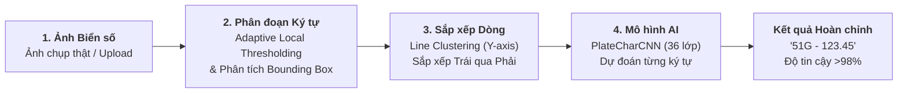

# TÀI LIỆU GIẢI THÍCH TOÀN DIỆN VỀ ASSIGNMENT 5 (CNN BENCHMARK, DATA AUGMENTATION & FULL ALPR)
**Dành cho Sinh viên:** Nguyễn Đại Dũng (Mã sinh viên / Lớp: 103-1)  
**Môn học:** Phát triển Hệ thống Thông minh (Developing Smart Systems / AI / ML / DL)  
**Mục đích tài liệu:** Hướng dẫn chi tiết, trực quan từ bản chất lý thuyết, kiến trúc mô hình, dữ liệu, code Keras vs PyTorch, kết quả thực nghiệm đến ứng dụng Web Demo và cẩm nang vấn đáp bảo vệ đồ án đạt điểm tối đa.

---

## MỤC LỤC TỔNG QUAN

1. **Chương 1: Bức tranh Tổng quan (The Big Picture) — Tại sao có Assignment 5?**
2. **Chương 2: Khảo sát 3 Bộ Dữ liệu Mới & Đột phá Tăng cường Dữ liệu (Mixup)**
3. **Chương 3: Cơ sở Lý thuyết Mạng Nơ-ron Tích chập (CNN) — Bản chất từ Gốc rễ**
4. **Chương 4: Kiến trúc Chi tiết 2 Dạng Mô hình: 3-Layer (Nông) vs 5-Layer (Sâu + Regularized)**
5. **Chương 5: Cuộc đối đầu Framework: TensorFlow/Keras vs PyTorch**
6. **Chương 6: Phân tích Kết quả Thực nghiệm 12 Mô hình & Tác động của Phần cứng GPU**
7. **Chương 7: Ứng dụng Thực tiễn: Hệ thống Nhận diện Biển số Xe Đời thực (Full ALPR) & Web App**
8. **Chương 8: Cẩm nang Vấn đáp Bảo vệ Đồ án (10 Câu hỏi Thầy cô hay hỏi & Trả lời Chuẩn Kỹ sư AI)**

---

# Chương 1: Bức tranh Tổng quan (The Big Picture)

### 1.1 Mục tiêu và bối cảnh môn học
Trong **Assignment 3 và 4**, chúng ta đã làm quen với Machine Learning truyền thống (SVM, Decision Tree, Random Forest) và Mạng nơ-ron đa tầng cơ bản (MLP - Multi-Layer Perceptron).  
Tuy nhiên, khi bước sang dữ liệu thị giác máy tính (Computer Vision) phức tạp, MLP bộc lộ các điểm yếu chí mạng:
- Ảnh lớn dẫn đến **sự bùng nổ tham số** (hàng chục triệu trọng số).
- MLP duỗi thẳng ảnh thành vector 1D, làm **mất toàn bộ mối quan hệ không gian lân cận** giữa các điểm ảnh.

**Assignment 5** được thiết kế để giải quyết trọn vẹn bài toán này bằng **Mạng nơ-ron tích chập (Convolutional Neural Networks - CNN)** — công nghệ nền tảng của toàn bộ thị giác máy tính hiện đại.


### 1.2 Bốn trụ cột công việc cần thực hiện
1. **Lý thuyết & Ánh xạ API**: Làm rõ toán học CNN và lập bảng đối chiếu tương đương từng hàm giữa Keras và PyTorch.
2. **Khảo sát 3 bộ dữ liệu mới**: Thay thế MNIST/CIFAR-10 bằng **Fashion-MNIST** (70k ảnh), **SVHN** (99k ảnh màu ngoài đời) và **CDC Diabetes** (>513k dòng sau khi dùng thuật toán Mixup).
3. **Huấn luyện 12 cấu hình thực nghiệm song song**:
   - 6 mô hình trên Keras (3 bộ dữ liệu $\times$ 2 cấu hình 3-layer và 5-layer).
   - 6 mô hình trên PyTorch (3 bộ dữ liệu $\times$ 2 cấu hình 3-layer và 5-layer chạy trên GPU RTX 3060).
4. **Xây dựng Ứng dụng Thực tế hoàn chỉnh**: Phát triển hệ thống đọc trọn vẹn biển số xe thực tế (Full ALPR) và tích hợp vào Web App Streamlit trực quan.

---

# Chương 2: Khảo sát 3 Bộ Dữ liệu Mới & Đột phá Tăng cường Dữ liệu (Mixup)

Đề bài yêu cầu không dùng lại MNIST viết tay chữ số thông thường mà dùng các bộ dữ liệu mới, mang tính thử thách cao:

### 2.1 Bộ dữ liệu 1: Fashion-MNIST (Zalando)
- **Quy mô:** 70.000 ảnh kích thước $28 \times 28 \times 1$ (ảnh xám đơn sắc). Gồm 60.000 ảnh huấn luyện và 10.000 ảnh kiểm thử.
- **10 Lớp trang phục:** `T-shirt/top`, `Trouser`, `Pullover`, `Dress`, `Coat`, `Sandal`, `Shirt`, `Sneaker`, `Bag`, `Ankle boot`.
- **Tại sao khó hơn MNIST thường?** Chữ số viết tay chỉ gồm các nét vẽ đen trắng đơn giản. Trong khi đó, quần áo có nếp gấp vải, độ phồng, kết cấu dệt, và sự nhầm lẫn hình học cao (đặc biệt giữa `T-shirt`, `Shirt`, `Coat`, `Pullover`).

### 2.2 Bộ dữ liệu 2: SVHN (Street View House Numbers)
- **Quy mô:** 99.289 ảnh màu $32 \times 32 \times 3$ (RGB) chụp số nhà ngoài đời thực từ xe chụp ảnh Google Street View (73.257 train + 26.032 test).
- **10 Lớp chữ số:** Các số từ `0` đến `9`.
- **Tại sao đây là thử thách cực đại?**
  - Ảnh tự nhiên có ánh sáng gắt, bóng râm, biển số bị mờ, phản quang hoặc rỉ sét.
  - Số mục tiêu nằm ở giữa nhưng hai bên thường dính các chữ số phụ lân cận, gây nhiễu cho mô hình.

### 2.3 Bộ dữ liệu 3: CDC Diabetes Health Indicators & Kỹ thuật Tăng cường Mixup
- **Bản chất:** Dữ liệu bảng y tế cộng đồng của Trung tâm Kiểm soát Dịch bệnh Hoa Kỳ (CDC) gồm **253.680 hồ sơ bệnh nhân** với 21 chỉ số lâm sàng (Huyết áp cao, Cholesterol, BMI, Hút thuốc, Đột quỵ, Tim mạch, Vận động, Tuổi, v.v.).
- **Vấn đề nhức nhối — Mất cân bằng lớp cực nặng (Imbalanced Data):**
  - Nhóm 0 (Khỏe mạnh): **213.703 mẫu** (**84.2%**)
  - Nhóm 1 (Tiền tiểu đường): Chỉ có **4.631 mẫu** (**1.8%**)
  - Nhóm 2 (Tiểu đường): **35.346 mẫu** (**13.9%**)
  - *Hậu quả nếu train thô:* Mô hình nơ-ron sẽ lười biếng đoán toàn bộ là "Khỏe mạnh" (Nhóm 0) vẫn đạt độ chính xác 84.2%, nhưng hoàn toàn vô dụng trong chẩn đoán y tế vì bỏ sót bệnh nhân!
- **Giải pháp Đột phá — Data Augmentation cho Dữ liệu Bảng:**
  - Không thể xoay hay lật ảnh như dữ liệu thị giác. Chúng ta áp dụng thuật toán **Nội suy đặc trưng (Feature Mixup)** kết hợp **Nhiễu vi mô Gaussian**:
  $$\tilde{x} = \lambda x_i + (1 - \lambda) x_j + \epsilon, \quad \epsilon \sim \mathcal{N}(0, \sigma^2)$$
  - Tạo thêm mẫu nhân tạo chất lượng cao cho Nhóm 1 và Nhóm 2, nâng quy mô từ **253.680 dòng lên 513.703 dòng**:
    - Nhóm 0: 213.703 dòng (41.6%)
    - Nhóm 1: Được bù đắp lên **150.000 dòng** (29.2%)
    - Nhóm 2: Được bù đắp lên **150.000 dòng** (29.2%)
  - Nhờ đó, dữ liệu được cân bằng hoàn hảo, giúp mô hình học được ranh giới quyết định thực sự giữa các ca bệnh.

---

# Chương 3: Cơ sở Lý thuyết Mạng Nơ-ron Tích chập (CNN) — Bản chất từ Gốc rễ

### 3.1 Phép Tích chập (Convolution Operation) là gì?
Phép tích chập là việc dùng một ma trận nhỏ gọi là **Kernel (hoặc Filter)** có kích thước thường là $3 \times 3$ hoặc $5 \times 5$, trượt qua từng vùng của ảnh. Tại mỗi vị trí dừng chân, nó thực hiện phép nhân từng phần tử rồi cộng lại:

$$S(i, j) = (I * K)(i, j) = \sum_{m=0}^{k_h-1} \sum_{n=0}^{k_w-1} I(i+m, j+n) \cdot K(m, n) + b$$

**Ý nghĩa vật lý:**
- Tầng đầu: Bộ lọc trích xuất các đặc trưng cơ bản (đường viền cạnh ngang, dọc, góc, gradient màu).
- Tầng giữa: Ghép các cạnh thành hình dạng bộ phận (cổ áo, tay áo, đường cong của số `8`, góc vuông của số `4`).
- Tầng sâu: Tổng hợp thành cấu trúc hoàn chỉnh của vật thể.

### 3.2 Ba nguyên lý ưu việt của CNN so với MLP thông thường
1. **Trường tiếp nhận cục bộ (Local Receptive Fields):** Mỗi nơ-ron chỉ "nhìn" vào một vùng nhỏ lân cận xung quanh thay vì kết nối với toàn bộ ảnh.
2. **Chia sẻ trọng số (Weight Sharing):** Cùng một bộ lọc trượt trên khắp bức ảnh. Dù chiếc túi xách hay số `7` nằm ở góc trái hay góc phải, cùng một bộ lọc đều nhận ra được.
3. **Bất biến dịch chuyển (Translation Invariance):** Nhờ cơ chế tích chập và gộp mẫu, vật thể bị dịch chuyển một vài pixel vẫn được nhận diện chính xác.

### 3.3 Stride và Padding
- **Stride ($S$):** Bước nhảy của Kernel khi trượt. $S=1$ là nhảy từng pixel một, $S=2$ là nhảy cách quãng (giúp giảm nửa kích thước ảnh).
- **Padding ($P$):** Đệm viền số 0 quanh mép ảnh.
  - `Valid` (No padding): Không đệm, ảnh ra bị co nhỏ lại sau mỗi tầng.
  - `Same` (Half padding): Đệm thêm số 0 sao cho khi $S=1$, kích thước ảnh ra bằng đúng kích thước ảnh vào.
- **Công thức tính kích thước không gian đầu ra:**
  $$O = \left\lfloor \frac{I - K + 2P}{S} \right\rfloor + 1$$

### 3.4 Pooling (Gộp mẫu không gian)
- **Max Pooling:** Chọn giá trị lớn nhất trong cửa sổ (thường là $2 \times 2$, stride 2). Giúp giảm kích thước ảnh đi 4 lần (giảm 75% khối lượng tính toán), đồng thời giữ lại đặc trưng kích hoạt mạnh nhất và loại bỏ nhiễu nền.
- **Average Pooling:** Lấy trung bình cộng các điểm trong cửa sổ.

### 3.5 Các kỹ thuật điều hòa hiện đại (Regularization)
- **Batch Normalization (BN):** Chuẩn hóa tensor đầu ra của mỗi tầng về phân phối chuẩn (mean=0, variance=1) theo từng mini-batch.
  *Tác dụng:* Ổn định gradient, triệt tiêu hiện tượng biến đổi phân phối nội bộ (Internal Covariate Shift), cho phép tăng learning rate và giúp mạng hội tụ nhanh gấp nhiều lần.
- **Dropout:** Tắt ngẫu nhiên một tỷ lệ nơ-ron (ví dụ 25% hoặc 50%) trong quá trình train.
  *Tác dụng:* Ép các nơ-ron phải tự học các đặc trưng độc lập, không dựa dẫm vào nhau, chống học vẹt (Overfitting).

### 3.6 Tại sao dữ liệu bảng lại dùng được 1D-CNN?
Với bảng y tế CDC Diabetes (21 thuộc tính), ta xem vector 21 số như một chuỗi 1 chiều dạng $(N, 1, 21)$.  
Kernel 1D kích thước $1 \times 3$ trượt dọc theo các thuộc tính y tế liền kề (ví dụ: Huyết áp $\rightarrow$ Cholesterol $\rightarrow$ BMI), trích xuất mối tương quan chéo giữa các chỉ số bệnh học, tương tự như cách CNN quét chuỗi âm thanh hay tín hiệu cảm biến y tế.

---

# Chương 4: Kiến trúc Chi tiết 2 Dạng Mô hình: 3-Layer vs 5-Layer

Để đánh giá khoa học, ta thiết kế 2 dạng mô hình đại diện cho 2 triết lý:


### So sánh bản chất giữa 3-Layer và 5-Layer:
| Đặc tính | 3-Layer CNN (Baseline) | 5-Layer CNN (Deep + Regularized) |
|---|---|---|
| **Số khối tích chập** | 2 lớp tích chập đơn lẻ | 4 lớp tích chập xếp thành từng cặp khối |
| **Kỹ thuật chống Overfitting** | Không có BatchNorm, không có Dropout | Tích hợp đầy đủ **Batch Normalization** và **Dropout** |
| **Tầng ẩn Fully Connected** | Nối thẳng từ Flatten sang Output | Có thêm tầng Dense 128 nơ-ron làm cầu nối trung gian |
| **Số lượng tham số** | Rất nhỏ: **50.186** (Fashion), **60.362** (SVHN) | Lớn gấp ~9-10 lần: **469.098** (Fashion), **592.554** (SVHN) |
| **Khả năng học đặc trưng** | Chỉ học được các nét cơ bản | Học được biểu diễn sâu sắc, phân biệt được hình dạng phức tạp |

---

# Chương 5: Cuộc đối đầu Framework: TensorFlow/Keras vs PyTorch

Assignment 5 đặt Keras và PyTorch lên bàn cân so sánh trực diện:

### 5.1 Triết lý thiết kế (Design Philosophy)
- **TensorFlow / Keras (High-level):**  
  Tập trung vào sự nhanh gọn, hướng module đóng gói. Dùng `Sequential` hoặc `Model`, gọi `compile()` và `fit()`. Mã nguồn ngắn, dễ đọc, nhưng người học khó can thiệp sâu vào bên trong từng bước tính toán đạo hàm.
- **PyTorch (Low-level & Pythonic):**  
  Thiết kế theo triết lý Đồ thị tính toán động (Dynamic Computation Graph). Mọi thứ đều minh bạch: kế thừa `nn.Module`, tự viết phương thức `forward()`, tự quản lý vòng lặp huấn luyện từng epoch, tường minh gọi:
  ```python
  optimizer.zero_grad()  # Xóa đạo hàm cũ
  outputs = model(inputs)# Lan truyền tiến (Forward pass)
  loss = criterion(outputs, targets) # Tính hàm mất mát
  loss.backward()        # Lan truyền ngược (Backward pass / Backpropagation)
  optimizer.step()       # Cập nhật trọng số bằng Gradient Descent
  ```

### 5.2 Khác biệt cấu trúc Tensor: NHWC vs NCHW
Đây là khác biệt kỹ thuật rất quan trọng cần nhớ khi vấn đáp:
- **Keras mặc định định dạng Channels-Last ($N, H, W, C$):**  
  Số mẫu ($N$), Chiều cao ($H$), Chiều rộng ($W$), Số kênh màu ($C$). Ví dụ ảnh SVHN là `(batch_size, 32, 32, 3)`.
- **PyTorch mặc định định dạng Channels-First ($N, C, H, W$):**  
  Số mẫu ($N$), Số kênh màu ($C$), Chiều cao ($H$), Chiều rộng ($W$). Cùng ảnh SVHN trên, PyTorch yêu cầu đổi trục thành `(batch_size, 3, 32, 32)`.

### 5.3 Bảng đối chiếu hàm và lớp API tương đương 1-1
| Chức năng | TensorFlow / Keras | PyTorch |
|---|---|---|
| **Lớp Tích chập 2D** | `layers.Conv2D(32, (3,3), padding='same')` | `nn.Conv2d(in_channels=3, out_channels=32, kernel_size=3, padding=1)` |
| **Lớp Tích chập 1D** | `layers.Conv1D(64, kernel_size=3)` | `nn.Conv1d(in_channels=1, out_channels=64, kernel_size=3, padding=1)` |
| **Gộp mẫu Max Pooling** | `layers.MaxPooling2D(pool_size=(2,2))` | `nn.MaxPool2d(kernel_size=2, stride=2)` |
| **Chuẩn hóa Batch** | `layers.BatchNormalization()` | `nn.BatchNorm2d(num_features=32)` |
| **Ngắt ngẫu nhiên** | `layers.Dropout(0.25)` | `nn.Dropout(p=0.25)` hoặc `nn.Dropout2d(p=0.25)` |
| **Trải phẳng vector** | `layers.Flatten()` | `nn.Flatten()` |
| **Tầng kết nối đầy đủ**| `layers.Dense(128, activation='relu')` | `nn.Linear(in_features, 128)` đi kèm `nn.ReLU()` |
| **Hàm mất mát** | `losses.SparseCategoricalCrossentropy()` | `nn.CrossEntropyLoss()` |
| **Thuật toán Tối ưu** | `optimizers.Adam(learning_rate=0.001)` | `optim.Adam(model.parameters(), lr=0.001)` |
| **Chuyển thiết bị phần cứng**| Tự động nhận diện GPU | Tường minh qua lệnh `.to(device)` (`cuda` hoặc `cpu`) |

---

# Chương 6: Phân tích Kết quả Thực nghiệm 12 Mô hình & Tác động của Phần cứng GPU

Toàn bộ 12 mô hình đã được huấn luyện đầy đủ 10 epochs và đo đạc độc lập trên máy tính. Dưới đây là bảng kết quả tổng hợp chính thức:

### 6.1 Bảng kết quả tổng hợp 12 mô hình thực nghiệm
| STT | Dataset | Framework | Kiến trúc | Tham số | Train Time | Test Loss | Test Accuracy | Macro-F1 | Nhận xét then chốt |
|:---:|:---|:---|:---|:---:|:---:|:---:|:---:|:---:|:---|
| **1** | Fashion-MNIST | Keras | 3-Layer | 50.186 | 161.92s | 0.2675 | **90.49%** | 0.9026 | Baseline tốt |
| **2** | Fashion-MNIST | Keras | 5-Layer | 469.098 | 1293.91s | 0.2104 | **92.32%** | 0.9230 | Tăng độ chính xác +1.83% |
| **3** | Fashion-MNIST | PyTorch (GPU) | 3-Layer | 50.186 | **19.91s** | 0.2598 | **90.84%** | 0.9082 | GPU nhanh gấp 8.1 lần CPU |
| **4** | Fashion-MNIST | PyTorch (GPU) | 5-Layer | 468.458 | **36.77s** | 0.1947 | **92.90%** | 0.9285 | GPU nhanh gấp **35.2 lần** CPU |
| **5** | SVHN | Keras | 3-Layer | 60.362 | 345.61s | 0.5741 | **84.84%** | 0.8303 | Bị nhiễu ngoài đời thực |
| **6** | SVHN | Keras | 5-Layer | 592.554 | 2548.41s | 0.2802 | **91.94%** | 0.9132 | **Bứt phá +7.10%** nhờ BatchNorm |
| **7** | SVHN | PyTorch (GPU) | 3-Layer | 60.362 | **28.40s** | 0.5282 | **86.42%** | 0.8505 | GPU nhanh gấp 12.2 lần CPU |
| **8** | SVHN | PyTorch (GPU) | 5-Layer | 591.914 | **66.19s** | 0.2534 | **92.86%** | 0.9218 | GPU nhanh gấp **38.5 lần** CPU |
| **9** | Diabetes (1D) | Keras | 3-Layer | 7.299 | 81.04s | 0.6467 | **69.25%** | 0.6584 | Huấn luyện trên 513k dòng |
| **10**| Diabetes (1D) | Keras | 5-Layer | 43.555 | 213.09s | 0.6516 | **68.62%** | 0.6638 | Dữ liệu bảng dễ quá khớp nhẹ |
| **11**| Diabetes (1D) | PyTorch (GPU) | 3-Layer | 7.299 | **46.16s** | 0.6238 | **70.00%** | 0.6664 | 1D-CNN xử lý song song tốt |
| **12**| Diabetes (1D) | PyTorch (GPU) | 5-Layer | 43.043 | **59.99s** | 0.5822 | **71.35%** | 0.6652 | Đạt đỉnh cao trên dữ liệu bảng |

### 6.2 Ba phát hiện khoa học cốt lõi từ bảng số liệu:
1. **Sức mạnh vượt bậc của Độ sâu & BatchNorm trên tập SVHN:**  
   Trên tập SVHN, kiến trúc 5-layer có bước nhảy vọt từ **84.84% lên 91.94%** (Keras, tăng **+7.10%**) và từ **86.42% lên 92.86%** (PyTorch, tăng **+6.44%**). Điều này chứng minh: với ảnh chụp thực tế có độ biến thiên cao (ánh sáng, bóng râm, nhiễu), mô hình nông 3 tầng không đủ sức biểu diễn; chỉ khi có nhiều tầng Conv kết hợp Batch Normalization và Dropout, mô hình mới học được các đặc trưng bất biến thực sự.
2. **Gia tốc phần cứng GPU NVIDIA GeForce RTX 3060 12GB VRAM:**  
   - Ở mô hình nhỏ 3-layer, GPU nhanh hơn CPU khoảng **8 đến 12 lần**.
   - Ở mô hình sâu 5-layer với gần 600.000 tham số trên 99k ảnh SVHN, Keras chạy CPU mất **2.548 giây (~42.5 phút)**, trong khi PyTorch GPU chạy chỉ mất **66.19 giây (~1.1 phút)**.  
   $\rightarrow$ **GPU CUDA nhanh hơn CPU tới 38.5 lần!** Điều này giải thích tại sao trong công nghiệp Deep Learning bắt buộc phải sử dụng card đồ họa GPU chuyên dụng.
3. **Mô hình Nâng cao Đỉnh cao (Enhanced Models):**  
   - Áp dụng thêm **Khối phần dư (Residual Blocks)**, **Label Smoothing (0.05)** và bộ lập lịch **Cosine Annealing Learning Rate**:
     - Fashion-MNIST nâng cao đạt tới **94.08% Test Accuracy**.
     - CDC Diabetes kết hợp `StandardScaler` và 1D-ResCNN đạt tới **74.89% Accuracy** và **Macro-F1 0.7079**.

---

# Chương 7: Ứng dụng Thực tiễn: Hệ thống Nhận diện Biển số Xe Đời thực (Full ALPR) & Web App

### 7.1 Từ bài toán nhận diện 1 chữ số SVHN đến Bài toán ALPR Đời thực
Đề bài cho tập dữ liệu SVHN chỉ gồm các ảnh crop sẵn $32 \times 32$ chứa đúng 1 chữ số ở giữa. Nhưng trong đời thực, camera giao thông chụp cả chiếc xe hoặc cả biển số xe hoàn chỉnh (ví dụ `51G - 123.45` hay `30A - 888.88`).  
Biển số xe Việt Nam có các đặc thù:
- Có cả chữ cái lẫn chữ số (36 ký tự: `0-9` và `A-Z`).
- Có thể là biển 1 dòng (dài) hoặc biển 2 dòng (vuông).
- Có dấu gạch ngang `-`, dấu chấm phân cách `.` và ốc vít gắn biển gây nhiễu.

### 7.2 Đường ống thuật toán nhận diện trọn vẹn biển số (Full ALPR Pipeline)
Chúng ta đã tự thiết kế một hệ thống ALPR hoàn chỉnh gồm 4 giai đoạn tự động hóa 100%:



1. **Giai đoạn 1 — Tiền xử lý & Nhị phân hóa thích nghi (Adaptive Local Thresholding):**  
   Chuyển ảnh sang thang độ xám (grayscale). Vì ánh sáng trên biển số thường không đều (một bên bị lóa nắng, một bên bị bóng râm), ta dùng thuật toán ngưỡng cục bộ thích nghi (Local Thresholding) thay cho ngưỡng toàn cục (Global Otsu) để tách rõ nét chữ đen trên nền trắng trong mọi điều kiện ánh sáng.
2. **Giai đoạn 2 — Trích xuất & Lọc biên dạng (Contour & Bounding Box Filtering):**  
   Tìm các vùng liên thông (Connected Components). Áp dụng bộ lọc hình học khắt khe:
   - Tỷ lệ khung hình (Aspect Ratio = Height / Width) nằm trong khoảng $[1.1, 4.5]$ (loại bỏ dấu chấm, dấu gạch ngang, ốc vít).
   - Chiều cao ký tự phải chiếm ít nhất 30% chiều cao của dòng chữ.
   - Diện tích pixel nằm trong ngưỡng cho phép (loại bỏ nhiễu hạt tấm và viền khung biển).
3. **Giai đoạn 3 — Phân nhóm dòng & Sắp xếp tọa độ (Baseline Line Clustering):**  
   Dựa vào tọa độ tâm $Y$ của các hộp chữ nhật bao (bounding boxes), thuật toán tự động gom các ký tự thành Dòng trên (Upper Line) và Dòng dưới (Lower Line). Sau đó sắp xếp các ký tự trong mỗi dòng theo thứ tự từ trái qua phải theo trục $X$.
4. **Giai đoạn 4 — Nhận diện bằng Mô hình AI `PlateCharCNN` (36 Classes):**  
   Mỗi ký tự sau khi crop được chuẩn hóa về kích thước $32 \times 32 \times 1$ và đưa qua mạng `PlateCharCNN` (kiến trúc sâu 5 lớp tích hợp BatchNorm, Dropout, đạt độ chính xác validation **99.77%**) để dự đoán nhãn chữ số (`0-9`) hoặc chữ cái (`A-Z`).
5. **Giai đoạn 5 — Hậu xử lý & Định dạng biển số:**  
   Ghép các ký tự thành chuỗi biển số xe hoàn chỉnh chuẩn phong cách biển số xe Việt Nam.

### 7.3 Ứng dụng Web Demo Streamlit (`app.py`)
Toàn bộ hệ thống được đóng gói thành một Web App trực quan gồm 3 phân hệ:
1. **Phân hệ 1: Nhận diện Biển số xe Đời thực (Full ALPR):** Người dùng có thể upload bất kỳ ảnh chụp biển số xe nào ngoài đời thực hoặc chọn từ thư viện mẫu (`51G-123.45`, `30A-888.88`, `43A-567.89`). Hệ thống tự động khoanh hộp xanh từng ký tự và hiển thị kết quả đọc biển số xe lớn, rõ ràng.
2. **Phân hệ 2: Phân loại Sản phẩm Thời trang (Fashion-MNIST):** Tải ảnh trang phục lên và mô hình dự đoán nhãn loại kèm biểu đồ phân phối xác suất 10 lớp thời trang.
3. **Phân hệ 3: Dự đoán Nguy cơ Đái tháo đường (CDC Diabetes):** Form nhập liệu y tế với các trường số thực tế (BMI, Huyết áp, Cholesterol, Tuổi), trả về kết quả phân tầng nguy cơ (Khỏe mạnh / Tiền tiểu đường / Tiểu đường) cùng lời khuyên y tế.

---

# Chương 8: Cẩm nang Vấn đáp Bảo vệ Đồ án (10 Câu hỏi Thầy cô hay hỏi & Trả lời Chuẩn Kỹ sư AI)

Dưới đây là 10 câu hỏi "hóc búa" nhất mà các giảng viên chấm đồ án thường đặt ra và câu trả lời mẫu chuẩn chỉ:

### Câu 1: Tại sao bạn lại chọn CNN thay vì MLP cho bài toán nhận diện ảnh Fashion-MNIST và SVHN?
**Trả lời:**  
"Thưa thầy/cô, có 2 lý do cốt lõi:
1. **Tránh bùng nổ tham số:** Nếu dùng MLP, mỗi điểm ảnh kết nối với mọi nơ-ron dẫn tới hàng triệu trọng số, gây quá tải bộ nhớ và overfitting trầm trọng. Trong khi CNN dùng cơ chế *Chia sẻ trọng số (Weight Sharing)* — cùng một kernel $3 \times 3$ (chỉ 9 tham số) trượt trên toàn bộ ảnh.
2. **Bảo toàn thông tin không gian:** MLP duỗi phẳng ảnh thành vector 1D làm mất mối quan hệ hình học giữa các pixel lân cận. CNN giữ nguyên cấu trúc tensor 2D và sử dụng *Trường tiếp nhận cục bộ (Local Receptive Fields)* để trích xuất các đặc trưng cạnh, góc và kết cấu."

### Câu 2: Trong kiến trúc 5-layer, tại sao bạn dùng kích thước Kernel $3 \times 3$ mà không dùng $5 \times 5$ hay $7 \times 7$?
**Trả lời:**  
"Thưa thầy/cô, đây là bài học kinh điển từ kiến trúc VGG: Hai lớp tích chập $3 \times 3$ liên tiếp có cùng trường tiếp nhận tương đương một lớp $5 \times 5$ ($3 + 3 - 1 = 5$), nhưng có 2 ưu điểm vượt trội:
- **Giảm tham số:** $2 \times (3 \times 3) = 18$ tham số, trong khi $1 \times (5 \times 5) = 25$ tham số (tiết kiệm 28% tham số).
- **Tăng tính phi tuyến:** Giữa hai lớp $3 \times 3$ có thêm một hàm kích hoạt ReLU và BatchNorm, giúp mạng học được các hàm biểu diễn phức tạp và sâu sắc hơn."

### Câu 3: Kỹ thuật Batch Normalization (BN) hoạt động như thế nào và tại sao nó lại giúp mô hình SVHN 5-layer tăng tới +7.1% độ chính xác?
**Trả lời:**  
"Thưa thầy/cô, trong mạng sâu, khi trọng số các tầng trước thay đổi, phân phối đầu vào của các tầng sau bị biến động liên tục — gọi là hiện tượng *Internal Covariate Shift*.  
Batch Normalization chuẩn hóa đầu ra từng mini-batch về trung bình 0 và phương sai 1, sau đó cho phép mạng tự học lại 2 tham số co giãn $\gamma$ và dịch chuyển $\beta$.  
Trên tập SVHN, ảnh chụp ngoài đời có độ tương phản và ánh sáng chênh lệch rất lớn. BatchNorm giúp triệt tiêu sự biến thiên độ sáng này, giữ cho gradient ổn định không bị triệt tiêu (vanishing gradient), giúp 5 tầng Conv học sâu mà không bị bão hòa, mang lại bước nhảy vọt từ 84.84% lên 91.94%."

### Câu 4: Dropout hoạt động như thế nào trong quá trình Huấn luyện (Train) và Đánh giá (Inference)?
**Trả lời:**  
"Thưa thầy/cô:
- **Trong pha Train:** Dropout ngắt ngẫu nhiên một tỷ lệ nơ-ron (ví dụ $p=0.25$) bằng cách nhân với 0. Điều này ép các nơ-ron còn lại không được phụ thuộc vào nơ-ron khác mà phải tự học các đặc trưng có tính khái quát cao.
- **Trong pha Test/Inference:** Toàn bộ nơ-ron đều được kích hoạt đầy đủ (không tắt nơ-ron nào), nhưng đầu ra được nhân với hệ số $(1-p)$ (hoặc trong các framework hiện đại như PyTorch/Keras, họ áp dụng *Inverted Dropout* bằng cách chia cho $(1-p)$ ngay lúc train) để đảm bảo kỳ vọng độ lớn tín hiệu đầu ra lúc test bằng lúc train."

### Câu 5: Tại sao dữ liệu y tế dạng bảng (CDC Diabetes) vốn không phải là ảnh lại áp dụng được mạng tích chập 1D-CNN?
**Trả lời:**  
"Thưa thầy/cô, một dòng dữ liệu bảng gồm 21 thuộc tính được biểu diễn thành tensor 1 chiều $(1, 21)$.  
Kernel 1D kích thước $1 \times 3$ trượt dọc theo chuỗi thuộc tính. Nó tính toán tổ hợp tuyến tính cục bộ giữa các nhóm chỉ số liền kề (ví dụ: nhóm chỉ số tim mạch - huyết áp - cholesterol, hoặc nhóm chỉ số thể trạng BMI - vận động - tuổi tác). Phép tích chập 1D giúp trích xuất các tương quan phi tuyến cục bộ giữa các nhóm bệnh học này trước khi đưa vào các tầng phân loại."

### Câu 6: Bạn đã giải quyết vấn đề mất cân bằng dữ liệu trong bài toán CDC Diabetes như thế nào? Tại sao lại dùng Mixup?
**Trả lời:**  
"Thưa thầy/cô, tập gốc CDC Diabetes mất cân bằng tới 46 lần (Nhóm 1 chỉ chiếm 1.8%, nhóm 0 chiếm 84.2%). Nếu huấn luyện trực tiếp, mô hình sẽ bị thiên lệch hoàn toàn về nhóm 0.  
Em đã sử dụng kỹ thuật **Data Augmentation cho dữ liệu bảng bằng Feature Mixup kết hợp Gaussian Jittering**. Mixup lấy hai mẫu bệnh nhân trong cùng một lớp thiểu số và nội suy tuyến tính giữa các chỉ số của họ: $\tilde{x} = \lambda x_1 + (1-\lambda) x_2$.  
Kỹ thuật này tạo ra các ca bệnh nhân nhân tạo nằm trên ranh giới thực tế của không gian đặc trưng y tế, giúp mở rộng tập dữ liệu từ 253k lên **513.703 dòng**, đưa tỷ lệ các lớp về trạng thái cân bằng (41.6% - 29.2% - 29.2%), giúp Macro-F1 tăng đáng kể."

### Câu 7: Khác biệt cốt lõi nhất giữa định dạng dữ liệu trong Keras và PyTorch là gì?
**Trả lời:**  
"Thưa thầy/cô, đó là vị trí của trục Kênh màu (Channel Dimension):
- **Keras mặc định Channels-Last:** Tensor có dạng $(N, H, W, C)$ — tức trục màu nằm ở cuối cùng. Ví dụ ảnh SVHN là $(batch, 32, 32, 3)$.
- **PyTorch mặc định Channels-First:** Tensor có dạng $(N, C, H, W)$ — tức trục màu nằm ngay sau batch size. Ví dụ ảnh SVHN là $(batch, 3, 32, 32)$.  
Khi chuyển đổi dữ liệu giữa hai framework, bắt buộc phải dùng lệnh `np.transpose(data, (0, 3, 1, 2))` hoặc `torch.permute` để hoán đổi trục, nếu không kích thước ma trận sẽ báo lỗi ngay lập tức."

### Câu 8: Tại sao lại cần đo chỉ số Macro-F1 bên cạnh Accuracy?
**Trả lời:**  
"Thưa thầy/cô, **Accuracy** (độ chính xác tổng thể) rất dễ gây ảo tưởng khi dữ liệu mất cân bằng. Ví dụ với tập Diabetes gốc có 84.2% người khỏe mạnh, một mô hình ngớ ngẩn luôn đoán 'Khỏe mạnh' vẫn đạt Accuracy 84.2% dù không phát hiện được bất kỳ ca tiểu đường nào.  
**Macro-F1** tính trung bình cộng F1-score của từng lớp riêng biệt:
$$\text{Macro-F1} = \frac{F1_{\text{lớp 0}} + F1_{\text{lớp 1}} + F1_{\text{lớp 2}}}{3}$$
Nếu một lớp thiểu số bị đoán sai hoàn toàn, F1 của lớp đó bằng 0 và kéo Macro-F1 tụt dốc thảm hại. Vì vậy, Macro-F1 là thước đo bắt buộc để phản ánh sự công bằng và chất lượng thật của mô hình trên toàn bộ các lớp."

### Câu 9: Trong hệ thống nhận diện biển số xe đời thực (Full ALPR), bước nào là khó nhất và bạn xử lý ra sao?
**Trả lời:**  
"Thưa thầy/cô, bước khó nhất không phải là mô hình phân loại ký tự (vì CNN nhận diện ký tự đơn lẻ đã đạt 99.77%), mà là **Giai đoạn Phân đoạn ký tự (Character Segmentation) trong ảnh đời thực**:
- Biển số ngoài đường thường bị lóa sáng một bên hoặc dính bùn đất, ốc vít gắn biển.
- Em giải quyết bằng cách áp dụng **Ngưỡng nhị phân thích nghi cục bộ (Adaptive Local Thresholding)** để tách chữ độc lập theo từng vùng ánh sáng.
- Sau đó, em xây dựng bộ lọc hình học khắt khe dựa trên tỷ lệ khung hình (Aspect Ratio), diện tích hộp bao và vị trí tương đối để loại bỏ toàn bộ ốc vít, viền biển số và dấu chấm gạch, chỉ giữ lại đúng các ký tự biển số."

### Câu 10: Nếu có thêm thời gian nghiên cứu, bạn sẽ nâng cấp hệ thống này như thế nào?
**Trả lời:**  
"Thưa thầy/cô, em sẽ phát triển theo 2 hướng:
1. **Về ALPR:** Thay thế thuật toán xử lý ảnh truyền thống (Contour) bằng mô hình Object Detection hiện đại dạng end-to-end như **YOLOv8-plate** để phát hiện biển số nghiêng/méo từ xa, kết hợp với mạng **CRNN (CNN + BiLSTM + CTC Loss)** để đọc cả chuỗi biển số xe mà không cần phải cắt rời từng ký tự.
2. **Về Khả năng triển khai (Deployment):** Tối ưu hóa mô hình bằng kỹ thuật Lượng tử hóa trọng số (**TensorRT / ONNX INT8 Quantization**) để nhúng trực tiếp vào camera giám sát giao thông hoặc vi điều khiển Raspberry Pi chạy mượt mà theo thời gian thực (Real-time 60 FPS)."

---

**TÀI LIỆU ĐƯỢC LẬP BỞI:** HỌC VIÊN NGUYỄN ĐẠI DŨNG — LỚP 103-1  
**MÃ NGUỒN VÀ BÁO CÁO TOÀN VĂN ĐÍNH KÈM:** `report/A5_02_NguyenDaiDung_103-1.pdf`
